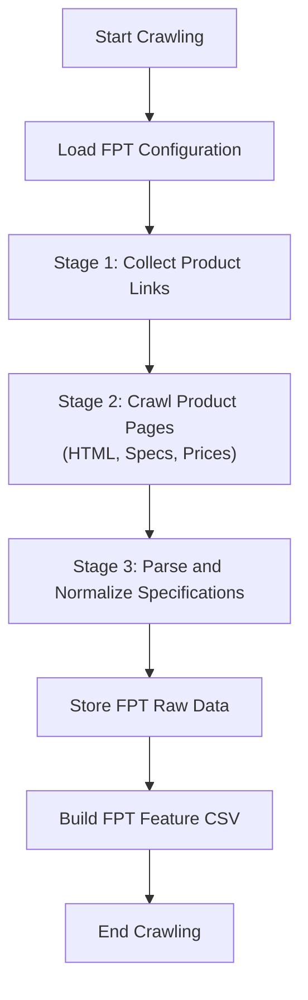
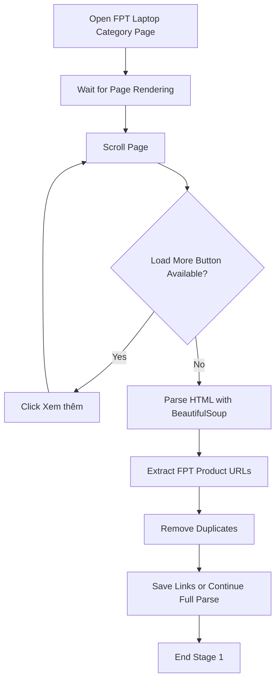
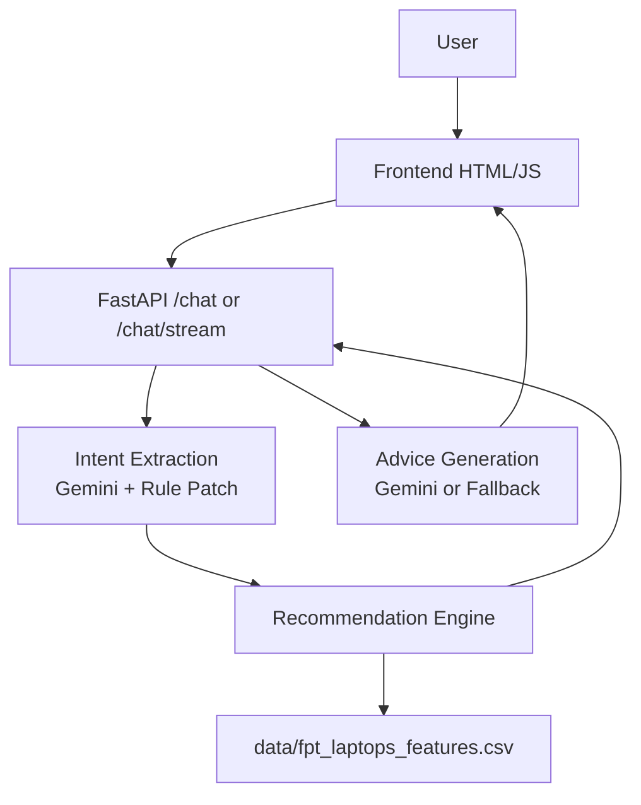
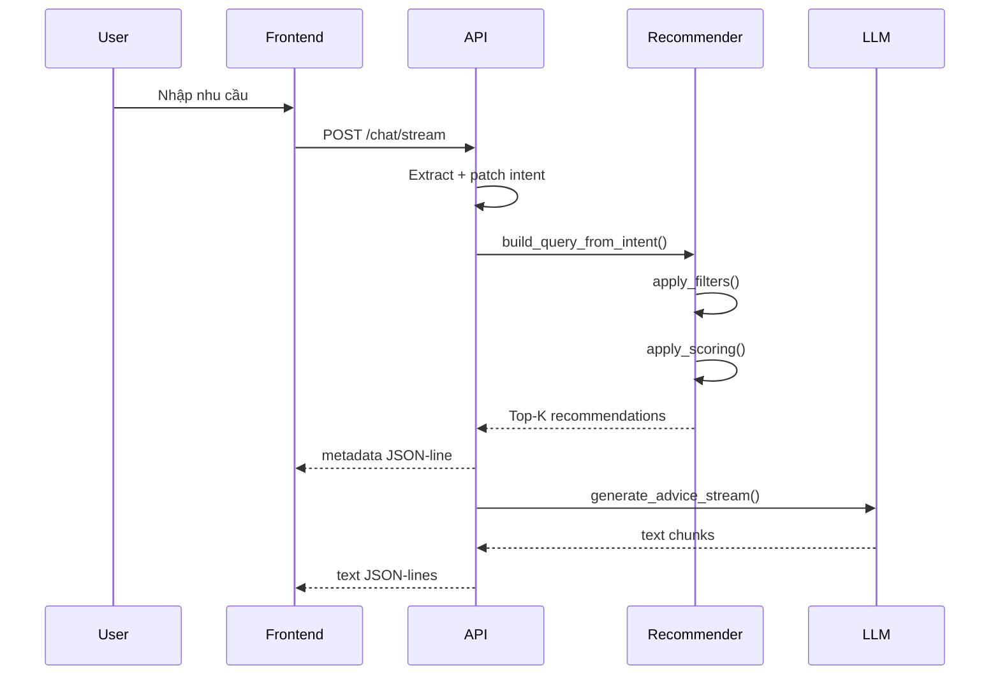

# ĐẠI HỌC BÁCH KHOA HÀ NỘI
# TRƯỜNG CÔNG NGHỆ THÔNG TIN VÀ TRUYỀN THÔNG

## NHẬP MÔN KHOA HỌC DỮ LIỆU - IT4142

# ĐỀ TÀI: FPT Shop Laptop Advisor Chatbot


Hà Nội, tháng 6 năm 2026

---

## Tóm tắt

Thị trường laptop hiện nay có rất nhiều lựa chọn với thông số kỹ thuật phức tạp, khiến người dùng khó xác định sản phẩm phù hợp với nhu cầu thực tế. Các trang thương mại điện tử thường cung cấp bộ lọc theo thông số như giá, CPU, RAM hoặc dung lượng lưu trữ, nhưng chưa giải thích rõ vì sao một sản phẩm phù hợp với từng bối cảnh sử dụng như học tập, văn phòng, gaming, lập trình hoặc nhu cầu di chuyển.

Dự án này xây dựng **FPT Shop Laptop Advisor Chatbot**, một hệ thống tư vấn laptop tập trung vào một nhà bán lẻ duy nhất là FPT Shop. Hệ thống được thiết kế theo pipeline Data Science: thu thập dữ liệu sản phẩm từ trang FPT Shop, chuẩn hóa thông số kỹ thuật, xây dựng feature phục vụ xếp hạng, áp dụng bộ lọc cứng và scoring mềm để chọn Top-K laptop phù hợp, sau đó dùng LLM để diễn giải nhu cầu người dùng và tạo câu trả lời tư vấn tự nhiên.

Khác với recommender system dựa trên học máy hoặc lịch sử người dùng, hệ thống hiện tại ưu tiên tính minh bạch và khả năng giải thích. Logic matching, filtering và scoring được triển khai theo luật xác định, trong khi LLM chỉ đảm nhiệm vai trò trích xuất ý định và tạo phản hồi hội thoại. Điều này giúp hệ thống dễ kiểm soát, dễ benchmark và phù hợp với bài toán tư vấn bán lẻ nơi độ tin cậy của thông tin sản phẩm là yêu cầu quan trọng.

---

## Mục lục

1. [Giới thiệu](#1-giới-thiệu)  
2. [Thu thập dữ liệu](#2-thu-thập-dữ-liệu)  
   2.1 [Giới thiệu](#21-giới-thiệu)  
   2.2 [Pipeline thu thập dữ liệu tổng thể](#22-pipeline-thu-thập-dữ-liệu-tổng-thể)  
   2.3 [Giai đoạn 1: Thu thập đường dẫn sản phẩm](#23-giai-đoạn-1-thu-thập-đường-dẫn-sản-phẩm)  
   2.4 [Giai đoạn 2: Crawl trang sản phẩm và trích xuất giá](#24-giai-đoạn-2-crawl-trang-sản-phẩm-và-trích-xuất-giá)  
   2.5 [Giai đoạn 3: Parse và chuẩn hóa thông số sản phẩm](#25-giai-đoạn-3-parse-và-chuẩn-hóa-thông-số-sản-phẩm)  
   2.6 [Tổng kết](#26-tổng-kết)  
3. [Phân tích khám phá dữ liệu](#3-phân-tích-khám-phá-dữ-liệu)  
4. [Tiền xử lý dữ liệu](#4-tiền-xử-lý-dữ-liệu)  
5. [Xây dựng đặc trưng](#5-xây-dựng-đặc-trưng)  
6. [Chatbot tư vấn laptop dựa trên AI](#6-chatbot-tư-vấn-laptop-dựa-trên-ai)  
7. [Đánh giá](#7-đánh-giá)  
8. [Kết luận](#8-kết-luận)  
9. [Phân công thành viên](#9-phân-công-thành-viên)

---

# 1. Giới thiệu

Sự phát triển nhanh của thị trường laptop tạo ra nhiều lựa chọn cho người dùng, nhưng đồng thời làm tăng độ khó trong việc lựa chọn thiết bị phù hợp. Một khách hàng không chuyên thường gặp khó khăn khi phải so sánh CPU, GPU, RAM, SSD, màn hình, trọng lượng, pin và giá bán để đưa ra quyết định mua hàng.

Trong bối cảnh bán lẻ, bài toán không chỉ là tìm sản phẩm có cấu hình mạnh nhất, mà là tìm sản phẩm phù hợp nhất với nhu cầu, ngân sách và chính sách mua hàng. Với FPT Shop, các yếu tố như trả góp 0%, quà tặng, ưu đãi học sinh - sinh viên, tình trạng hàng và link mua hàng trực tiếp cũng là những tín hiệu quan trọng trong quá trình tư vấn.

Dự án hiện tại chuyển hướng từ một hệ thống tư vấn laptop tổng quát sang chatbot chuyên biệt cho FPT Shop. Hệ thống tập trung vào:

- Dữ liệu sản phẩm FPT-only.
- Matching Top-K dựa trên bộ lọc cứng và scoring mềm.
- Output tư vấn mượt qua API streaming.
- Giao diện chat có thẻ sản phẩm và link mua tại FPT Shop.
- Benchmark bằng các tiêu chí `Precision@K`, `NDCG@K`, `MRR` và `CSR`.

Phương pháp được lựa chọn là rule-based scoring kết hợp LLM. Phần scoring giữ tính xác định và dễ kiểm chứng; phần LLM hỗ trợ hiểu ngôn ngữ tự nhiên và diễn giải kết quả theo phong cách tư vấn viên FPT Shop.

---

# 2. Thu thập dữ liệu

## 2.1 Giới thiệu

Data crawling là bước đầu tiên trong pipeline xây dựng hệ thống tư vấn laptop. Chất lượng dữ liệu ảnh hưởng trực tiếp đến các bước phía sau như preprocessing, feature engineering, filtering, scoring và evaluation.

Trong project hiện tại, nguồn dữ liệu được giới hạn ở **FPT Shop** thay vì nhiều website bán lẻ. Việc tập trung vào một nhà bán lẻ giúp hệ thống:

- Phản ánh đúng kho hàng và giá bán của FPT Shop.
- Tránh so sánh sản phẩm giữa nhiều website có chính sách giá khác nhau.
- Dễ triển khai persona tư vấn viên FPT Shop.
- Dễ gắn CTA trực tiếp về trang sản phẩm FPT.
- Phù hợp với mục tiêu chatbot cho một công ty bán lẻ cụ thể.

Nguồn dữ liệu chính:

| Thành phần | Giá trị |
|---|---|
| Retailer | FPT Shop |
| Category URL | `https://fptshop.com.vn/may-tinh-xach-tay` |
| Raw JSON | `data/fpt_laptops.json` |
| Feature CSV | `data/fpt_laptops_features.csv` |
| Config | `config/shops/fpt.json` |

## 2.2 Pipeline thu thập dữ liệu tổng thể

Pipeline crawl hiện tại được tổ chức thành ba stage chính: thu thập link sản phẩm, tải trang chi tiết sản phẩm, và parse/chuẩn hóa thông số.



**Figure 1:** Overall flowchart of the FPT Shop laptop data crawling pipeline.

Pipeline gồm các bước:

1. Đọc cấu hình FPT trong `config/shops/fpt.json`.
2. Dùng Selenium để mở trang danh mục laptop FPT.
3. Cuộn trang và bấm nút "xem thêm" để load thêm sản phẩm.
4. Trích xuất URL sản phẩm bằng BeautifulSoup.
5. Tải từng trang sản phẩm và parse giá, ảnh, specs.
6. Lưu raw JSON vào `data/fpt_laptops.json`.
7. Build feature CSV bằng `src/build_dataset.py`.

Lệnh chạy sau này:

```bash
python3 src/run_shop.py --max-clicks 50 --out data/fpt_laptops.json
python3 src/build_dataset.py
```

Kết quả cần cập nhật sau khi chạy:

| Artifact | Trạng thái hiện tại | Cập nhật sau khi chạy |
|---|---:|---|
| Số link sản phẩm thu được | Chưa chạy lại trong phiên báo cáo | TBD |
| Số sản phẩm raw hợp lệ | 412 raw hiện có | TBD |
| Số sản phẩm vào feature CSV | 162 valid hiện có | TBD |
| File output | `data/fpt_laptops_features.csv` | TBD |

## 2.3 Giai đoạn 1: Thu thập đường dẫn sản phẩm

Stage đầu tiên thu thập toàn bộ URL sản phẩm laptop từ trang danh mục FPT Shop. Trang FPT sử dụng cơ chế tải động bằng JavaScript, người dùng cần cuộn xuống và bấm "xem thêm" để hiển thị thêm sản phẩm. Vì vậy, crawler dùng Selenium WebDriver thay vì chỉ dùng HTTP request tĩnh.

Quy trình:



**Figure 2:** Detailed flowchart of Stage 1: Collecting FPT laptop product links.

Selector chính được lưu trong:

```json
{
  "shop": "fpt",
  "product_link_selector": "a[href*='/may-tinh-xach-tay/']",
  "load_more_selectors": [
    ".st-pd-btnShowmore",
    ".light-btn",
    ".btn-show-more",
    ".show-more",
    ".view-more"
  ]
}
```

Các URL không phải trang sản phẩm được loại bỏ bằng hàm `_is_fpt_product_url()`, ví dụ các slug danh mục như `asus`, `lenovo`, `gaming-do-hoa`, `apple-macbook`.

## 2.4 Giai đoạn 2: Crawl trang sản phẩm và trích xuất giá

Sau khi có danh sách URL, hệ thống tải từng trang chi tiết sản phẩm và trích xuất thông tin cần thiết.

### 2.4.1 Tải HTML của từng laptop

Module `src/dynamic_load_crawler.py` dùng `requests` để tải trang chi tiết sản phẩm theo URL đã thu được. Việc tải trang chi tiết tách khỏi bước Selenium giúp pipeline nhẹ hơn, vì Selenium chỉ cần dùng cho trang danh mục có nút "xem thêm".

Hàm chính:

```text
crawl_and_parse_fpt_products(urls, max_workers=5, save_html=False)
```

Chế độ `save_html=True` chỉ dùng khi cần debug selector, tránh giữ raw HTML nặng trong repo chính.

### 2.4.2 Trích xuất giá

Giá bán được trích xuất theo thứ tự ưu tiên:

1. JSON-LD hoặc structured data có `"priceCurrency": "VND"`.
2. Meta tag như `meta[itemprop='price']`.
3. CSS selector giá phổ biến trên FPT.
4. Lọc token số nằm trong khoảng giá laptop hợp lý.

Giá được chuẩn hóa về số nguyên VND. Ví dụ:

```text
"21.790.000đ" -> 21790000
```

Kết quả hiện tại trong CSV:

| Chỉ số giá | Giá trị hiện tại |
|---|---:|
| Min price | 11,290,000 VND |
| Median price | 27,740,000 VND |
| Max price | 198,990,000 VND |

### 2.4.3 Crawl đa luồng với ThreadPoolExecutor

Việc tải trang chi tiết sản phẩm được thực hiện song song bằng `ThreadPoolExecutor`. Mục tiêu là giảm thời gian crawl nhưng vẫn giữ pipeline đơn giản.

Thông số hiện tại:

| Thành phần | Giá trị |
|---|---:|
| Default workers | 5 |
| Request timeout | 20 giây |
| Output raw JSON | `data/fpt_laptops.json` |

Kết quả chạy chính thức sẽ được cập nhật tại đây sau khi thực hiện crawl.

## 2.5 Giai đoạn 3: Parse và chuẩn hóa thông số sản phẩm

### 2.5.1 Chiến lược parse

Trang sản phẩm FPT có thể trình bày specs trong nhiều dạng HTML khác nhau. Parser ưu tiên các container có class/id liên quan đến specs như:

- `spec`
- `thong-so`
- `parameter`
- `config`
- `product-info-table`
- `product-specs`

Nếu không tìm thấy container rõ ràng, parser quét bảng HTML và danh sách `li` có cấu trúc `key: value`.

### 2.5.2 Thuộc tính được parse và logic riêng cho FPT

Các thuộc tính chuẩn hóa hiện tại:

| Nhóm | Thuộc tính |
|---|---|
| Product | `Product Name`, `Manufacturer`, `url`, `image`, `source` |
| CPU | `CPU manufacturer`, `CPU brand modifier`, `CPU generation`, `CPU Speed (GHz)` |
| Memory | `RAM (GB)`, `RAM Type`, `Bus (MHz)` |
| Storage | `Storage (GB)` |
| Display | `Screen Size (inch)`, `Screen Resolution`, `Refresh Rate (Hz)` |
| Graphics | `GPU manufacturer` |
| Portability | `Weight (kg)`, `Battery`, `Battery (Wh)` |
| Retail | `Price (VND)`, `Original Price (VND)`, `Is Installment 0%`, `Student Discount (VND)`, `Gifts`, `Stock Status` |

Vì dữ liệu FPT hiện có một số trang thiếu bảng specs đầy đủ, hệ thống có thêm inference từ tên sản phẩm, đặc biệt cho:

- Manufacturer
- RAM
- Storage
- GPU/gaming signal
- Installment 0%

### 2.5.3 Chuẩn hóa và làm sạch dữ liệu

Chuẩn hóa bao gồm:

- Chuyển giá, RAM, SSD, màn hình, refresh rate, weight sang numeric.
- Chuẩn hóa pin Wh nếu có.
- Gán `Stock Status = In Stock` nếu nguồn dữ liệu chưa có trạng thái rõ ràng.
- Bổ sung score chuẩn hóa (`norm_ram`, `norm_storage`, `norm_price`, `norm_weight`, `norm_screen`, `norm_battery`).
- Loại bỏ dòng không có tên hoặc không có giá.

### 2.5.4 Định dạng đầu ra

Output chính:

```text
data/fpt_laptops_features.csv
```

Hiện trạng trước khi chạy lại pipeline chính thức:

| Chỉ số | Giá trị hiện tại |
|---|---:|
| Số dòng | 162 |
| Số cột | 50 |
| Số brand | 10 |
| Price fill rate | 100.0% |
| RAM fill rate | 82.7% |
| Storage fill rate | 82.7% |
| Screen size fill rate | 37.7% |
| GPU manufacturer fill rate | 25.3% |
| CPU manufacturer fill rate | 54.9% |
| Weight fill rate | 0.0% |
| Battery fill rate | 0.0% |
| Stock status fill rate | 100.0% |

## 2.6 Tổng kết

Pipeline crawl hiện tại đã được thu gọn thành FPT-only. Project chính không còn crawler hoặc config cho các shop khác. Dữ liệu giữ lại phục vụ trực tiếp cho bài toán hiện tại:

- `data/fpt_laptops.json`
- `data/fpt_laptops_features.csv`
- `data/fpt_test_queries.json`
- `data/fpt_evaluation_results.json`
- `data/fpt_metrics_summary.json`

Sau khi chạy lại crawler, cần cập nhật các bảng ở Section 2 để phản ánh số lượng sản phẩm mới và chất lượng dữ liệu mới.

---

# 3. Phân tích khám phá dữ liệu

## 3.1 Tổng quan dữ liệu

Dataset hiện tại gồm 162 sản phẩm hợp lệ từ FPT Shop sau khi build từ `data/fpt_laptops.json`. Mỗi sản phẩm có 50 cột sau khi bổ sung feature runtime/scoring.

**Figure 8:** Dataset Structure Overview.  
Trạng thái: cần cập nhật bằng hình/table sau khi chạy EDA chính thức.

Key observations hiện tại:

- Dataset đã được thu gọn về FPT-only.
- Giá bán có fill rate 100%.
- RAM và Storage có fill rate 82.7%, đủ để chạy matching cơ bản.
- CPU/GPU/Screen còn thiếu ở một phần lớn sản phẩm do raw specs FPT hiện có chưa đầy đủ.
- Weight và Battery hiện chưa có trong dataset, nên các scoring liên quan portability/battery dùng fallback trung lập.

## 3.2 Phân tích đơn biến

### 3.2.1 Phân phối giá và phân khúc ngân sách

**Figure 9:** Distribution of Laptop Prices.  
Trạng thái: cần tạo sau khi chạy EDA.

Thống kê giá hiện tại:

| Metric | Value |
|---|---:|
| Minimum | 11,290,000 VND |
| Median | 27,740,000 VND |
| Maximum | 198,990,000 VND |

Phân khúc đề xuất để cập nhật khi chạy EDA:

| Segment | Range |
|---|---|
| Budget | `< 15M` |
| Mid-range | `15M - 25M` |
| Upper mid-range | `25M - 40M` |
| Premium | `> 40M` |

**Figure 10:** Distribution of Laptops by User Budget Segment.  
Trạng thái: cần cập nhật sau khi chạy script EDA.

### 3.2.2 Thị phần nhà sản xuất

Brand distribution hiện tại:

| Manufacturer | Số mẫu |
|---|---:|
| Apple | 43 |
| HP | 27 |
| Asus | 24 |
| Acer | 19 |
| Lenovo | 16 |
| Dell | 14 |
| MSI | 13 |
| Gigabyte | 4 |
| Colorful | 1 |
| LG | 1 |

**Figure 11:** Number of Models by Manufacturer.  
Trạng thái: cần cập nhật bằng chart sau khi chạy EDA.

## 3.3 Xu hướng phần cứng

### 3.3.1 Cấu hình RAM sau chuẩn hóa

RAM distribution hiện tại:

| RAM | Số mẫu |
|---:|---:|
| 16GB | 78 |
| Missing | 28 |
| 32GB | 20 |
| 24GB | 18 |
| 8GB | 7 |
| 48GB | 5 |
| 64GB | 3 |
| 36GB | 2 |
| 128GB | 1 |

Storage distribution hiện tại:

| Storage | Số mẫu |
|---:|---:|
| 512GB | 81 |
| 1TB | 30 |
| Missing | 28 |
| 2TB | 13 |
| 4TB | 5 |
| 256GB | 4 |
| 8TB | 1 |

**Figure 12:** Top 10 Most Common Configurations.  
Trạng thái: cần cập nhật sau khi chạy EDA.

**Figure 13:** Price Distribution by RAM Capacity.  
Trạng thái: cần cập nhật sau khi chạy EDA.

### 3.3.2 Bức tranh GPU

GPU manufacturer fill rate hiện tại là 25.3%. Đây là hạn chế của dataset hiện tại vì nhiều trang FPT trong raw JSON không có specs chi tiết. Để tránh recommendation rỗng cho gaming, hệ thống bổ sung tín hiệu từ tên sản phẩm như `Gaming`, `TUF`, `ROG`, `Nitro`, `LOQ`, `Legion`, `Victus`, `Predator`.

**Figure 14:** Laptop Types based on GPU Category.  
Trạng thái: cần cập nhật sau khi crawl/parse specs đầy đủ hơn.

**Figure 15:** Top 10 Most Common GPU Models.  
Trạng thái: chưa áp dụng do dataset hiện chỉ chuẩn hóa `GPU manufacturer`, chưa có `gpu_model` chi tiết.

**Figure 16:** Price Distribution by Top GPU Groups.  
Trạng thái: cần cập nhật sau khi cải thiện GPU extraction.

## 3.4 Phân tích tính di động và đặc điểm vật lý

Weight hiện chưa có trong dataset FPT hiện tại. Do đó, phân tích portability chưa thể kết luận chính thức.

Khi chạy lại crawler và parser, cần ưu tiên trích xuất:

- `Weight (kg)`
- `Battery`
- `Battery (Wh)`
- Kích thước màn hình

## 3.5 Phân tích đánh đổi tính di động

**Figure 17:** Portability Trade-off: Screen Size vs. Weight.  
Trạng thái: chờ dữ liệu Weight.

Khi có dữ liệu weight đầy đủ, phân tích sẽ tập trung vào:

- Nhóm 13-14 inch mỏng nhẹ.
- Nhóm 15.6-16 inch phổ thông/gaming.
- Quan hệ giữa trọng lượng, giá và scoring hiệu năng.

### 3.5.1 "Chi phí trọng lượng" của hiệu năng

**Figure 18:** Weight vs. Price for Gaming/High-performance Models.  
Trạng thái: chờ dữ liệu Weight và GPU tốt hơn.

Dự kiến insight cần kiểm chứng: laptop gaming hoặc workstation thường có trọng lượng cao hơn do yêu cầu tản nhiệt, trong khi ultrabook và MacBook tập trung vào tính di động.

---

# 4. Tiền xử lý dữ liệu

Data preprocessing chuyển raw FPT data thành format phù hợp cho recommendation engine.

## 4.1 Làm sạch dữ liệu và điền khuyết

Các bước đã triển khai:

- Loại sản phẩm không có tên.
- Loại sản phẩm không có giá bán.
- Deduplicate theo URL.
- Convert numeric columns bằng `pd.to_numeric`.
- Fill `Stock Status = In Stock` nếu thiếu.
- Fill retail fields mặc định: `Student Discount = 0`, `Gifts = ""`.
- Infer RAM/Storage/Manufacturer từ tên sản phẩm khi specs thiếu.

Các cột còn thiếu nhiều và cần cải thiện parser:

| Cột | Fill rate hiện tại | Ghi chú |
|---|---:|---|
| CPU manufacturer | 54.9% | Có thể cải thiện từ tên và specs |
| GPU manufacturer | 25.3% | Cần parse GPU model tốt hơn |
| Screen Size | 37.7% | Có thể infer từ tên |
| Weight | 0.0% | Cần selector/spec parser bổ sung |
| Battery | 0.0% | Cần selector/spec parser bổ sung |

## 4.2 Phân loại GPU

### 4.2.1 Trích xuất và chuẩn hóa

Hiện tại GPU được chuẩn hóa ở mức manufacturer:

- NVIDIA
- AMD
- Intel
- Apple

Ngoài ra, hệ thống dùng tín hiệu tên dòng máy để hỗ trợ gaming score trong trường hợp GPU thiếu:

- `tuf`
- `rog`
- `nitro`
- `loq`
- `legion`
- `victus`
- `predator`
- `gaming`

### 4.2.2 Logic phân loại model

Logic scoring GPU hiện tại nằm trong `src/advisor/features.py`:

| Tín hiệu | Điểm gần đúng |
|---|---:|
| RTX 40/50 | 1.00 |
| RTX 30 | 0.88 |
| RTX 20/GTX | 0.72 |
| NVIDIA/GeForce | 0.66 |
| Gaming line name | 0.64 |
| Radeon RX | 0.70 |
| Intel Iris/Arc | 0.55 |
| Integrated/common GPU | 0.48 |

Mục tiêu là giữ recommendation không bị rỗng khi specs chưa đầy đủ, nhưng vẫn ưu tiên dòng gaming khi user hỏi gaming.

## 4.3 Chuẩn hóa và scoring

Các feature numeric được chuẩn hóa bằng robust quantile scaling:

```text
norm_x = clip((x - q05) / (q95 - q05), 0, 1)
```

Các cột normalize chính:

- `norm_ram`
- `norm_storage`
- `norm_price`
- `norm_weight`
- `norm_screen`
- `norm_battery`
- `norm_cpu`

Với trường thiếu dữ liệu, hệ thống dùng fallback trung lập để scoring không bị lỗi.

---

# 5. Xây dựng đặc trưng

## 5.1 Tổng quan

Feature engineering biến thông số kỹ thuật thành các tín hiệu phục vụ recommendation. Mục tiêu không phải huấn luyện model, mà tạo ra các score dễ giải thích cho từng nhu cầu.

Các nhóm feature chính:

- Base performance score
- GPU score
- Task-oriented scores
- Retail preference bonuses
- Binary tags for explainability

## 5.2 Điểm cơ sở

Base performance score tổng hợp CPU, GPU, RAM và Storage:

```text
base_performance_score =
    norm_cpu * 0.45
  + gpu_score * 0.30
  + norm_ram * 0.15
  + norm_storage * 0.10
```

Score này đóng vai trò nền cho gaming, AI/graphics và general-purpose ranking.

## 5.3 Điểm hiệu năng GPU

GPU score được xác định bằng luật dựa trên tên GPU hoặc tên sản phẩm. Với dataset hiện tại, gaming-line signals đóng vai trò quan trọng vì nhiều sản phẩm FPT chưa có GPU specs đầy đủ.

Ví dụ:

```text
Asus TUF / ROG / Acer Nitro / Lenovo LOQ / HP Victus -> gaming signal
```

## 5.4 Điểm tổng hợp theo tác vụ

Các score theo mục đích sử dụng được xây dựng để mapping từ nhu cầu tự nhiên sang ranking kỹ thuật.

### 5.4.1 Điểm gaming

```text
gaming_score =
    gpu_score * 0.60
  + base_performance_score * 0.25
  + norm_ram * 0.15
```

Gaming ưu tiên GPU và hiệu năng tổng thể.

### 5.4.2 Điểm AI và đồ họa

```text
ai_graphics_score =
    gpu_score * 0.55
  + base_performance_score * 0.30
  + norm_ram * 0.15
```

Score này dùng cho query liên quan AI, graphics, rendering hoặc lập trình cần cấu hình mạnh.

### 5.4.3 Điểm văn phòng và doanh nghiệp

```text
office_score =
    base_performance_score * 0.45
  + norm_weight * 0.35
  + battery_score * 0.20
```

Vì weight/battery hiện còn thiếu, score này đang phụ thuộc nhiều vào performance fallback. Sau khi parser thu được weight/battery, score sẽ phản ánh tốt hơn nhu cầu văn phòng/di chuyển.

### 5.4.4 Điểm tính di động

```text
portability_score =
    norm_weight * 0.45
  + battery_score * 0.35
  + (1 - norm_screen) * 0.20
```

Portability score cần được cập nhật lại sau khi crawler trích xuất được weight/battery.

### 5.4.5 Điểm sử dụng tổng quát

```text
general_score =
    office_score * 0.45
  + base_performance_score * 0.35
  + portability_score * 0.20
```

Score này dùng cho query không có nhu cầu rõ ràng hoặc nhu cầu phổ thông.

## 5.5 Nhãn nhị phân phục vụ giải thích

Các binary tags phục vụ giải thích và UI:

| Tag | Ý nghĩa |
|---|---|
| `is_gaming_ready` | Có tín hiệu phù hợp gaming |
| `is_ai_ready` | Phù hợp AI/graphics |
| `is_business_ready` | Phù hợp văn phòng/doanh nhân |
| `is_ultrabook` | Mỏng nhẹ/pin tốt theo feature hiện có |
| `is_light` | Trọng lượng <= 1.7kg nếu có dữ liệu |
| `is_small_screen` | Màn hình nhỏ gọn |
| `is_large_screen` | Màn hình lớn |

## 5.6 Bộ dữ liệu đặc trưng đầu ra

Output feature dataset hiện tại:

```text
data/fpt_laptops_features.csv
```

Thông tin hiện tại:

| Chỉ số | Giá trị |
|---|---:|
| Rows | 162 |
| Columns | 50 |
| Main source | FPT Shop |
| Recommendation input | Có |
| Benchmark input | Có |

---

# 6. Chatbot tư vấn laptop dựa trên AI

## 6.1 Mục tiêu của tính năng

Mục tiêu của chatbot là cho phép người dùng nhập nhu cầu bằng ngôn ngữ tự nhiên và nhận lại danh sách Top-K laptop FPT phù hợp, kèm giải thích dễ hiểu và link mua hàng.

Ví dụ nhu cầu:

```text
"Mình là sinh viên cần laptop văn phòng nhẹ dưới 20 triệu, trả góp 0% càng tốt"
```

Hệ thống cần trả về:

- Intent đã trích xuất.
- Query object cho recommendation engine.
- Top-K laptop phù hợp.
- Câu trả lời tư vấn tự nhiên.
- Product cards trên frontend.

## 6.2 Tổng quan tính năng

Luồng chatbot:

1. User nhập message.
2. API trích xuất intent bằng Gemini nếu có API key, fallback rule-based nếu không.
3. Intent được patch bằng regex/rule để bắt ngân sách, RAM, SSD, brand, trả góp, quà tặng.
4. Recommendation engine lọc và chấm điểm.
5. API trả metadata sản phẩm trước, sau đó stream câu trả lời.
6. Frontend render product cards và text streaming.

## 6.3 Kiến trúc hệ thống và công nghệ



**Figure 19:** Chatbot architecture for FPT Shop Laptop Advisor.

### 6.3.1 Giao diện người dùng (Frontend)

Frontend nằm trong:

```text
frontend/index.html
```

Chức năng chính:

- Chat input.
- Gọi `/chat/stream`.
- Đọc streaming JSON-lines.
- Render bot answer theo từng chunk.
- Render product cards.
- Modal xem thông số và link mua FPT.

### 6.3.2 Dịch vụ backend

Backend nằm trong:

```text
src/api/main.py
```

Endpoints:

| Endpoint | Vai trò |
|---|---|
| `GET /health` | Kiểm tra trạng thái API và dataset |
| `POST /chat` | Trả full JSON response |
| `POST /chat/stream` | Trả metadata + text streaming |

Dataset mặc định:

```text
data/fpt_laptops_features.csv
```

### 6.3.3 Thành phần trí tuệ nhân tạo

LLM được dùng cho:

- Structured intent extraction.
- Advice generation.

Nếu không có `GEMINI_API_KEY` hoặc SDK chưa sẵn sàng, hệ thống vẫn chạy bằng fallback rule-based:

- Intent mặc định `general`, sau đó patch từ text.
- Advice fallback bằng template tiếng Việt.

## 6.4 Quy trình hoạt động của chatbot



## 6.5 Thiết kế recommendation engine

### 6.5.1 Module lọc (Constraint-Based Filtering)

Filter module nằm trong:

```text
src/advisor/filters.py
```

Hard filters:

- `price_min`
- `price_max`
- `ram_exact_gb`
- `min_ram_gb`
- `min_storage_gb`
- `min_weight_kg`
- `max_weight_kg`
- Brand exclude
- CPU requirements
- Display requirements
- Battery requirements
- Stock status

Gaming không còn bị hard-filter tuyệt đối để tránh trả rỗng khi dữ liệu GPU thiếu; thay vào đó gaming được ưu tiên trong scoring.

### 6.5.2 Module scoring (Multi-Criteria Ranking)

Scorer nằm trong:

```text
src/advisor/scorer.py
```

Scorer kết hợp:

- Task score theo intent.
- Affordability score.
- Weight score.
- Brand preference bonus.
- Retail bonuses:
  - `pref_installment`
  - `is_student`
  - `need_gifts`
- Battery/display/ready flag bonuses.

Final score:

```text
final_score = weighted_task_affordability_weight + soft_bonuses
```

Sau đó kết quả được sort giảm dần theo `final_score`.

### 6.5.3 Module advisor (Explainability Layer)

Advisor layer gồm:

- `src/advisor/recommend_service.py`: chuyển dataframe Top-K thành JSON.
- `src/advisor/advisor.py`: gọi filter + scorer.
- `src/llm/prompts.py`: persona tư vấn viên FPT Shop.

Output recommendation JSON gồm:

- Tên máy.
- Brand.
- Giá bán.
- Giá gốc nếu có.
- RAM/Storage/Screen/CPU.
- Retail fields: trả góp, quà tặng, ưu đãi HSSV.
- Scores và flags.
- Link mua hàng.

---

# 7. Đánh giá

## 7.1 Bộ câu hỏi đánh giá

Benchmark hiện tại dùng:

```text
data/fpt_test_queries.json
```

Số query hiện tại: 10.

Các nhóm query:

- Sinh viên/văn phòng/ngân sách.
- Gaming dưới ngân sách.
- Brand preference.
- Laptop nhẹ.
- MacBook/pin tốt/doanh nhân.
- RAM/SSD constraints.
- AI/lập trình.
- Query phổ thông.

## 7.2 Chấm điểm độ phù hợp

Evaluator nằm trong:

```text
src/evaluation/evaluator.py
```

Hai chế độ judge:

| Judge | Mục đích |
|---|---|
| `rule` | Offline benchmark, deterministic, không cần API key |
| `gemini` | LLM relevance judge nếu có Gemini key |

Rule-based judge chấm điểm:

- `2`: phù hợp đầy đủ.
- `1`: phù hợp một phần hoặc là lựa chọn thay thế hợp lý.
- `0`: không phù hợp.

## 7.3 Chỉ số đánh giá

Các metric giống cấu trúc benchmark mẫu:

### Precision@K

```text
Precision@K = số item relevant trong Top-K / K
```

### NDCG@K

Đo chất lượng thứ tự ranking, ưu tiên item relevance cao ở vị trí đầu.

### MRR

Mean Reciprocal Rank đo vị trí của item relevant đầu tiên.

### CSR

Constraint Satisfaction Rate đo tỷ lệ recommendations thỏa tất cả hard constraints.

```text
CSR = số recommendation thỏa constraints / số recommendation
```

## 7.4 Kết quả

Kết quả benchmark hiện tại:

| Metric | Value |
|---|---:|
| Num queries | 10 |
| Top-K | 3 |
| Precision@K | 1.0000 |
| NDCG@K | 0.9766 |
| MRR | 1.0000 |
| CSR | 1.0000 |

Lệnh chạy:

```bash
python3 -m src.evaluation.run_evaluation \
  --file data/fpt_test_queries.json \
  --top-k 3 \
  --judge rule \
  --mode direct \
  --output data/fpt_evaluation_results.json \
  --metrics-output data/fpt_metrics_summary.json
```

Kết quả này là benchmark offline/rule-based trên dataset hiện tại. Sau khi crawl lại FPT, cần chạy lại benchmark và cập nhật bảng này.

## 7.5 Phân tích

Kết quả hiện tại cho thấy:

- Matching Top-K hoạt động ổn trên các query benchmark đã định nghĩa.
- CSR đạt 100% vì hard constraints được phân biệt rõ với soft preferences.
- Query gaming không bị trả rỗng nhờ chuyển gaming từ hard-filter sang scoring.
- Brand, RAM, Storage, khoảng giá và retail intent được patch bằng rule từ text.

Các hạn chế cần tiếp tục cải thiện:

- Weight và Battery chưa có trong dataset hiện tại.
- GPU extraction còn thiếu, phải dùng thêm tín hiệu tên dòng máy.
- Retail fields như `Gifts`, `Original Price`, `Student Discount` cần parse tốt hơn từ trang FPT.
- Gemini judge chưa chạy trong benchmark chính thức.

## 7.6 Thảo luận

Hướng đánh giá tiếp theo:

1. Chạy lại crawl FPT để lấy dữ liệu mới.
2. Build lại `fpt_laptops_features.csv`.
3. Kiểm tra fill rate sau crawl.
4. Chạy benchmark rule-based.
5. Nếu có Gemini key, chạy thêm Gemini relevance judge.
6. Cập nhật các bảng Section 2, 3 và 7.

Checklist cập nhật sau khi chạy:

| Bước | Command | Kết quả cần ghi |
|---|---|---|
| Crawl FPT | `python3 src/run_shop.py --max-clicks 50 --out data/fpt_laptops.json` | Số sản phẩm raw |
| Build CSV | `python3 src/build_dataset.py` | Rows, columns, fill rates |
| API smoke test | `POST /chat` | Số recommendations, sample output |
| Benchmark | `python3 -m src.evaluation.run_evaluation ...` | Precision@K, NDCG@K, MRR, CSR |

---

# 8. Kết luận

Dự án hiện tại đã chuyển từ hướng laptop advisor tổng quát sang chatbot tư vấn laptop chuyên biệt cho FPT Shop. Pipeline chính đã được thu gọn và tập trung vào dữ liệu FPT-only, với dataset chính là `data/fpt_laptops_features.csv`.

Hệ thống hiện có đầy đủ các thành phần cốt lõi:

- FPT crawler và parser.
- Feature extraction và preprocessing.
- Rule-based scoring engine.
- FastAPI backend với streaming.
- Frontend chat UI.
- LLM intent/advice integration có fallback.
- Evaluation pipeline với các metric IR và CSR.

Điểm mạnh của hệ thống là tính minh bạch: recommendation không phụ thuộc vào model học máy khó giải thích, mà dựa trên scoring rõ ràng và có thể kiểm thử. Điều này phù hợp với bài toán tư vấn bán lẻ, nơi hệ thống cần tránh bịa thông tin và chỉ tư vấn dựa trên dữ liệu sản phẩm có thật.

Các bước tiếp theo là chạy lại pipeline chính thức, cải thiện parser cho specs/retail fields, sinh chart EDA, và cập nhật báo cáo này bằng kết quả thực nghiệm mới.

---

# 9. Phân công thành viên

| Thành viên | MSSV | Phân công | Trạng thái |
|---|---|---|---|
| Cập nhật sau | Cập nhật sau | Data crawling / preprocessing | TBD |
| Cập nhật sau | Cập nhật sau | Feature engineering / scoring | TBD |
| Cập nhật sau | Cập nhật sau | Backend / LLM / streaming | TBD |
| Cập nhật sau | Cập nhật sau | Frontend / evaluation / report | TBD |

---

## Nhật ký chạy

Phần này dùng để cập nhật kết quả sau mỗi lần chạy pipeline.

| Date | Step | Command | Result | Notes |
|---|---|---|---|---|
| 2026-06-11 | Initial report draft | N/A | Created report structure | Chờ chạy pipeline chính thức |
