# ĐẠI HỌC BÁCH KHOA HÀ NỘI
# TRƯỜNG CÔNG NGHỆ THÔNG TIN VÀ TRUYỀN THÔNG

## NHẬP MÔN KHOA HỌC DỮ LIỆU - IT4142

# ĐỀ TÀI: FPT Shop Laptop Advisor Chatbot


Hà Nội, tháng 6 năm 2026

---

## Tóm tắt

Thị trường laptop hiện nay có rất nhiều lựa chọn với thông số kỹ thuật phức tạp, khiến người dùng khó xác định sản phẩm phù hợp với nhu cầu thực tế. Các trang thương mại điện tử thường cung cấp bộ lọc theo thông số như giá, CPU, RAM hoặc dung lượng lưu trữ, nhưng chưa giải thích rõ vì sao một sản phẩm phù hợp với từng bối cảnh sử dụng như học tập, văn phòng, gaming, lập trình hoặc nhu cầu di chuyển.

Dự án này xây dựng **FPT Shop Laptop Advisor Chatbot**, một hệ thống tư vấn laptop tập trung vào một nhà bán lẻ duy nhất là FPT Shop. Hệ thống được thiết kế theo pipeline Data Science: thu thập dữ liệu sản phẩm từ trang FPT Shop, chuẩn hóa thông số kỹ thuật, xây dựng feature phục vụ xếp hạng, áp dụng bộ lọc cứng và scoring mềm để chọn Top-K laptop phù hợp, sau đó dùng LLM để diễn giải nhu cầu người dùng và tạo câu trả lời tư vấn tự nhiên.

Khác với recommender system dựa trên học máy hoặc lịch sử người dùng, hệ thống hiện tại ưu tiên tính minh bạch và khả năng giải thích. Logic matching, filtering và scoring được triển khai theo luật xác định, trong khi LLM chỉ đảm nhiệm vai trò trích xuất ý định và tạo phản hồi hội thoại. Điều này giúp hệ thống dễ kiểm soát, dễ benchmark và phù hợp với bài toán tư vấn bán lẻ nơi độ tin cậy của thông tin sản phẩm là yêu cầu quan trọng.

---

## Mục lục

1. [Giới thiệu](#1-giới-thiệu)  
2. [Thu thập dữ liệu](#2-thu-thập-dữ-liệu)  
   2.1 [Giới thiệu](#21-giới-thiệu)  
   2.2 [Pipeline thu thập dữ liệu tổng thể](#22-pipeline-thu-thập-dữ-liệu-tổng-thể)  
   2.3 [Giai đoạn 1: Thu thập đường dẫn sản phẩm](#23-giai-đoạn-1-thu-thập-đường-dẫn-sản-phẩm)  
   2.4 [Giai đoạn 2: Crawl trang sản phẩm và trích xuất giá](#24-giai-đoạn-2-crawl-trang-sản-phẩm-và-trích-xuất-giá)  
   2.5 [Giai đoạn 3: Parse và chuẩn hóa thông số sản phẩm](#25-giai-đoạn-3-parse-và-chuẩn-hóa-thông-số-sản-phẩm)  
   2.6 [Tổng kết](#26-tổng-kết)  
3. [Phân tích khám phá dữ liệu](#3-phân-tích-khám-phá-dữ-liệu)  
4. [Tiền xử lý dữ liệu](#4-tiền-xử-lý-dữ-liệu)  
5. [Xây dựng đặc trưng](#5-xây-dựng-đặc-trưng)  
6. [Chatbot tư vấn laptop dựa trên AI](#6-chatbot-tư-vấn-laptop-dựa-trên-ai)  
7. [Đánh giá](#7-đánh-giá)  
8. [Kết luận](#8-kết-luận)  
9. [Phân công thành viên](#9-phân-công-thành-viên)

---

# 1. Giới thiệu

Sự phát triển nhanh của thị trường laptop tạo ra nhiều lựa chọn cho người dùng, nhưng đồng thời làm tăng độ khó trong việc lựa chọn thiết bị phù hợp. Một khách hàng không chuyên thường gặp khó khăn khi phải so sánh CPU, GPU, RAM, SSD, màn hình, trọng lượng, pin và giá bán để đưa ra quyết định mua hàng.

Trong bối cảnh bán lẻ, bài toán không chỉ là tìm sản phẩm có cấu hình mạnh nhất, mà là tìm sản phẩm phù hợp nhất với nhu cầu, ngân sách và chính sách mua hàng. Với FPT Shop, các yếu tố như trả góp 0%, quà tặng, ưu đãi học sinh - sinh viên, tình trạng hàng và link mua hàng trực tiếp cũng là những tín hiệu quan trọng trong quá trình tư vấn.

Dự án hiện tại chuyển hướng từ một hệ thống tư vấn laptop tổng quát sang chatbot chuyên biệt cho FPT Shop. Hệ thống tập trung vào:

- Dữ liệu sản phẩm FPT-only.
- Matching Top-K dựa trên bộ lọc cứng và scoring mềm.
- Output tư vấn mượt qua API streaming.
- Giao diện chat có thẻ sản phẩm và link mua tại FPT Shop.
- Benchmark bằng các tiêu chí `Precision@K`, `NDCG@K`, `MRR` và `CSR`.

Phương pháp được lựa chọn là rule-based scoring kết hợp LLM. Phần scoring giữ tính xác định và dễ kiểm chứng; phần LLM hỗ trợ hiểu ngôn ngữ tự nhiên và diễn giải kết quả theo phong cách tư vấn viên FPT Shop.

Ở phiên bản dữ liệu hiện tại, hệ thống đã sử dụng được tên SKU, giá bán, hãng, ảnh, URL và phần lớn thông số cấu hình. Các trường bán lẻ mở rộng gồm giá gốc, trả góp 0%, ưu đãi học sinh - sinh viên, quà tặng và tình trạng tồn kho đã được thiết kế trong schema nhưng chưa được nguồn crawl hiện tại cung cấp đầy đủ. Vì vậy, recommendation và báo cáo thực nghiệm hiện chủ yếu dựa trên giá bán và cấu hình; hệ thống không dùng các giá trị retail mặc định để khẳng định một chương trình ưu đãi đang thực sự áp dụng.

---

# 2. Thu thập dữ liệu

## 2.1 Giới thiệu

Data crawling là bước đầu tiên trong pipeline xây dựng hệ thống tư vấn laptop. Chất lượng dữ liệu ảnh hưởng trực tiếp đến các bước phía sau như preprocessing, feature engineering, filtering, scoring và evaluation.

Trong project hiện tại, nguồn dữ liệu được giới hạn ở **FPT Shop** thay vì nhiều website bán lẻ. Việc tập trung vào một nhà bán lẻ giúp hệ thống:

- Phản ánh đúng kho hàng và giá bán của FPT Shop.
- Tránh so sánh sản phẩm giữa nhiều website có chính sách giá khác nhau.
- Dễ triển khai persona tư vấn viên FPT Shop.
- Dễ gắn CTA trực tiếp về trang sản phẩm FPT.
- Phù hợp với mục tiêu chatbot cho một công ty bán lẻ cụ thể.

Nguồn dữ liệu chính:

| Thành phần | Giá trị |
|---|---|
| Retailer | FPT Shop |
| Category URL | `https://fptshop.com.vn/may-tinh-xach-tay` |
| Raw JSON | `data/fpt_laptops.json` |
| Feature CSV | `data/fpt_laptops_features.csv` |
| Config | `config/shops/fpt.json` |

## 2.2 Pipeline thu thập dữ liệu tổng thể

Pipeline crawl hiện tại được tổ chức thành ba stage chính: thu thập link/SKU sản phẩm, tải trang chi tiết sản phẩm, và parse/chuẩn hóa thông số. Khác với bản thiết kế ban đầu dựa trên giao diện "xem thêm", pipeline hiện tại ưu tiên FPT category API để lấy đầy đủ SKU; Selenium chỉ còn là fallback khi API không trả dữ liệu.

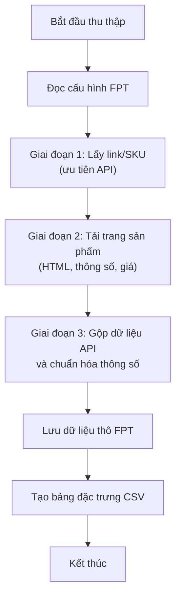

**Hình 1:** Pipeline crawl dữ liệu FPT.

Pipeline gồm các bước:

1. Đọc cấu hình FPT trong `config/shops/fpt.json`.
2. Gọi FPT category API theo batch để lấy danh sách sản phẩm/SKU laptop.
3. Trích xuất slug SKU và cache metadata từ API như tên SKU, giá, giá gốc, ảnh, brand và key selling points.
4. Nếu API không trả dữ liệu, dùng Selenium để cuộn trang và bấm "xem thêm" như phương án fallback.
5. Tải từng trang chi tiết sản phẩm và parse giá, ảnh, specs.
6. Merge metadata từ API với JSON-LD/specs trên trang chi tiết.
7. Lưu raw JSON vào `data/fpt_laptops.json`.
8. Build feature CSV bằng `src/build_dataset.py`.

Kết quả chạy ngày 2026-06-11:

| Artifact | Kết quả |
|---|---:|
| Số link/SKU sản phẩm thu được | 417 |
| Số SKU raw hợp lệ | 417 |
| Số SKU vào feature CSV | 417 |
| Số tên sản phẩm duy nhất | 364 |
| File output | `data/fpt_laptops_features.csv` |

## 2.3 Giai đoạn 1: Thu thập đường dẫn sản phẩm

Stage đầu tiên thu thập toàn bộ URL/SKU laptop từ trang danh mục FPT Shop. Dù giao diện người dùng có cơ chế cuộn và bấm "xem thêm", hệ thống hiện tại dùng API danh mục của FPT làm nguồn chính vì API trả được danh sách SKU ổn định hơn và tránh phụ thuộc vào trạng thái render của trình duyệt.

Quy trình:

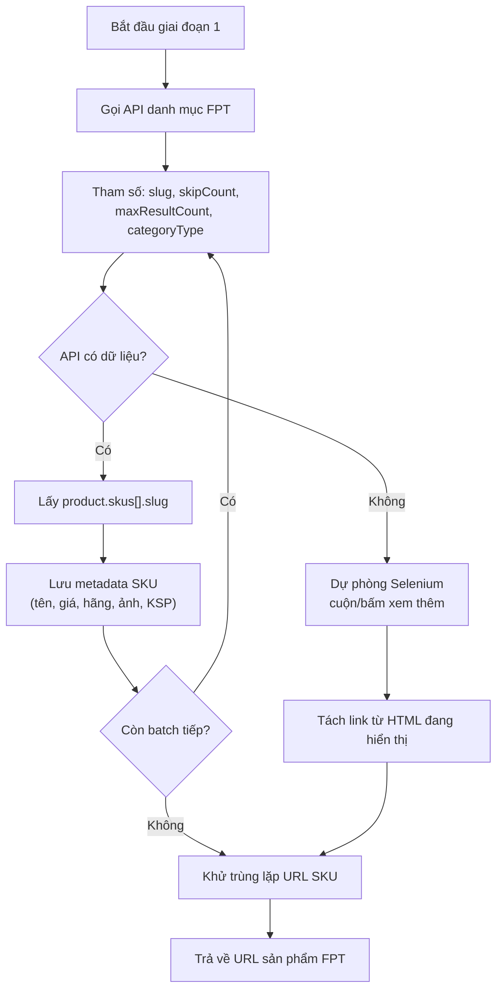

**Hình 2:** Thu thập link/SKU laptop FPT.

Thông tin triển khai chính:

| Thành phần | Giá trị |
|---|---|
| Hàm API-first | `crawl_fpt_links_via_api()` |
| FPT API | `https://papi.fptshop.com.vn/gw/v1/public/fulltext-search-service/category` |
| Category slug | `may-tinh-xach-tay` |
| Batch size hiện tại | `24` SKU/lần gọi |
| Trường URL chính | `product.skus[].slug` |
| Metadata cache | `displayName`, `currentPrice`, `originalPrice`, `image`, `brand`, `keySellingPoints` |
| Fallback UI | `crawl_fpt_links()` bằng Selenium |

Selector fallback được lưu trong:

```json
{
  "shop": "fpt",
  "product_link_selector": "a[href*='/may-tinh-xach-tay/']",
  "load_more_selectors": [
    ".st-pd-btnShowmore",
    ".light-btn",
    ".btn-show-more",
    ".show-more",
    ".view-more"
  ]
}
```

Các URL không phải trang sản phẩm được loại bỏ bằng hàm `_is_fpt_product_url()`, ví dụ các slug danh mục như `asus`, `lenovo`, `gaming-do-hoa`, `apple-macbook`.

## 2.4 Giai đoạn 2: Crawl trang sản phẩm và trích xuất giá

Sau khi có danh sách URL, hệ thống tải từng trang chi tiết sản phẩm và trích xuất thông tin cần thiết.

### 2.4.1 Tải HTML của từng laptop

Module `src/dynamic_load_crawler.py` dùng `requests` để tải trang chi tiết sản phẩm theo URL đã thu được. Việc tải trang chi tiết tách khỏi bước thu thập link giúp pipeline nhẹ hơn; Selenium chỉ được dùng khi API danh mục không hoạt động hoặc cần debug giao diện.

Hàm chính:

```text
crawl_and_parse_fpt_products(urls, max_workers=5, save_html=False)
```

Chế độ `save_html=True` chỉ dùng khi cần debug selector, tránh giữ raw HTML nặng trong repo chính.

### 2.4.2 Trích xuất giá

Giá bán cuối cùng được chọn theo thứ tự ưu tiên:

1. `currentPrice` của SKU từ FPT category API.
2. JSON-LD hoặc structured data trên trang chi tiết có `"priceCurrency": "VND"`.
3. Meta tag như `meta[itemprop='price']`.
4. CSS selector giá phổ biến trên FPT.
5. Lọc token số nằm trong khoảng giá laptop hợp lý.

Giá được chuẩn hóa về số nguyên VND. Ví dụ:

```text
"21.790.000đ" -> 21790000
```

Kết quả hiện tại trong CSV:

| Chỉ số giá | Giá trị hiện tại |
|---|---:|
| Min price | 6,890,000 VND |
| Median price | 30,690,000 VND |
| Max price | 199,490,000 VND |

### 2.4.3 Crawl đa luồng với ThreadPoolExecutor

Việc tải trang chi tiết sản phẩm được thực hiện song song bằng `ThreadPoolExecutor`. Mục tiêu là giảm thời gian crawl nhưng vẫn giữ pipeline đơn giản.

Thông số hiện tại:

| Thành phần | Giá trị |
|---|---:|
| Default workers | 5 |
| Request timeout | 20 giây |
| Output raw JSON | `data/fpt_laptops.json` |

Kết quả chạy chính thức ngày 2026-06-11: crawler thu được 417 SKU hợp lệ, tương ứng 364 tên sản phẩm duy nhất. Không có SKU nào thiếu URL, tên, giá hoặc ảnh.

## 2.5 Giai đoạn 3: Parse và chuẩn hóa thông số sản phẩm

### 2.5.1 Chiến lược parse

Trang sản phẩm FPT có thể trình bày specs trong nhiều dạng HTML khác nhau. Parser hiện dùng chiến lược nhiều tầng theo thứ tự ưu tiên:

1. Metadata đã cache từ FPT category API.
2. JSON-LD trên trang chi tiết, đặc biệt là `additionalProperty`.
3. Các container HTML có class/id liên quan đến specs như:

   - `spec`
   - `thong-so`
   - `parameter`
   - `config`
   - `product-info-table`
   - `product-specs`

Nếu không tìm thấy container rõ ràng, parser quét bảng HTML và danh sách `li` có cấu trúc `key: value`.

### 2.5.2 Thuộc tính được parse và logic riêng cho FPT

Các thuộc tính chuẩn hóa hiện tại:

| Nhóm | Thuộc tính |
|---|---|
| Product | `Product Name`, `Manufacturer`, `url`, `image`, `source` |
| CPU | `CPU manufacturer`, `CPU brand modifier`, `CPU generation`, `CPU Speed (GHz)` |
| Memory | `RAM (GB)`, `RAM Type`, `Bus (MHz)` |
| Storage | `Storage (GB)` |
| Display | `Screen Size (inch)`, `Screen Resolution`, `Refresh Rate (Hz)` |
| Graphics | `GPU manufacturer`, `GPU model`, `GPU type` |
| Portability | `Weight (kg)`, `Battery`, `Battery (Wh)`, `Battery life (hours)` |
| Retail | `Price (VND)`, `Original Price (VND)`, `Is Installment 0%`, `Student Discount (VND)`, `Gifts`, `Stock Status` |

Mức độ sẵn sàng của nhóm retail trong dataset hiện tại:

| Thuộc tính | Dữ liệu thực tế |
|---|---:|
| `Price (VND)` | 417/417 SKU |
| `Original Price (VND)` | 0/417 SKU |
| `Is Installment 0%` | Chưa nhận diện được; 417 giá trị mặc định `False` |
| `Student Discount (VND)` | Chưa nhận diện được; 417 giá trị mặc định `0` |
| `Gifts` | 0/417 SKU |
| `Stock Status` | Chưa crawl được; 417 giá trị fallback `In Stock` |

Các giá trị mặc định giúp schema và API hoạt động ổn định nhưng không được xem là bằng chứng về chương trình ưu đãi hoặc tồn kho thực tế.

Vì dữ liệu FPT hiện có một số trang thiếu bảng specs đầy đủ, hệ thống có thêm inference từ tên sản phẩm, đặc biệt cho:

- Manufacturer
- RAM
- Storage
- GPU/gaming signal
- Tín hiệu trả góp 0% nếu nguồn text có đề cập

Riêng với FPT, metadata từ API category giúp ổn định việc nhận diện SKU và các trường retail mà API thực sự trả về:

| Nguồn tín hiệu | Mục đích |
|---|---|
| `sku.displayName` | Tên SKU đầy đủ để infer RAM/Storage/CPU/GPU |
| `currentPrice` | Giá bán hiện tại |
| `originalPrice` | Giá gốc nếu API cung cấp; batch hiện tại chưa có giá trị |
| `brand` | Manufacturer fallback |
| `image` | Ảnh sản phẩm |
| `keySellingPoints` | Bổ sung thông số nổi bật khi trang chi tiết thiếu specs |

### 2.5.3 Chuẩn hóa và làm sạch dữ liệu

Chuẩn hóa bao gồm:

- Chuyển giá, RAM, SSD, màn hình, tần số quét và cân nặng sang dữ liệu số.
- Chuẩn hóa pin Wh nếu có.
- Gán fallback `Stock Status = In Stock` nếu nguồn dữ liệu chưa có trạng thái rõ ràng; không dùng fallback này để kết luận tồn kho.
- Bổ sung score chuẩn hóa (`norm_ram`, `norm_storage`, `norm_price`, `norm_weight`, `norm_screen`, `norm_battery`).
- Loại bỏ dòng không có tên hoặc không có giá.

### 2.5.4 Định dạng đầu ra

Output chính:

```text
data/fpt_laptops_features.csv
```

Hiện trạng sau khi chạy lại pipeline ngày 2026-06-11:

| Chỉ số | Giá trị hiện tại |
|---|---:|
| Số SKU | 417 |
| Số tên sản phẩm duy nhất | 364 |
| Số cột | 53 |
| Số brand | 11 |
| Price fill rate | 100.0% |
| RAM fill rate | 100.0% |
| Storage fill rate | 99.8% |
| Screen size fill rate | 100.0% |
| GPU manufacturer fill rate | 99.0% |
| GPU model fill rate | 99.0% |
| GPU type fill rate | 99.0% |
| CPU manufacturer fill rate | 84.9% |
| Weight fill rate | 1.4% |
| Battery fill rate | 16.1% |
| Battery (Wh) fill rate | 1.0% |
| Battery life fill rate | 15.1% |
| Stock status fill rate | 100.0% fallback; chưa có dữ liệu tồn kho thực |

## 2.6 Tổng kết

Pipeline crawl hiện tại đã được thu gọn thành FPT-only. Project chính không còn crawler hoặc config cho các shop khác. Dữ liệu giữ lại phục vụ trực tiếp cho bài toán hiện tại:

- `data/fpt_laptops.json`
- `data/fpt_laptops_features.csv`
- `data/fpt_test_queries.json`
- `data/fpt_evaluation_results.json`
- `data/fpt_metrics_summary.json`

Sau khi chạy lại crawler, dataset đã tăng từ 162 lên 417 SKU hợp lệ, tương ứng 364 tên sản phẩm duy nhất. Các cột phục vụ matching chính như giá, RAM, Storage, Screen Size và GPU đã có fill rate cao. Weight, Battery và nhóm retail mở rộng vẫn cần cải thiện; dữ liệu pin hiện mới tập trung ở một số dòng sản phẩm.

---

# 3. Phân tích khám phá dữ liệu

## 3.1 Tổng quan dữ liệu

Dataset hiện tại gồm 417 SKU hợp lệ từ FPT Shop, tương ứng 364 tên sản phẩm duy nhất. Sau khi bổ sung GPU và các thuộc tính pin, feature CSV có 53 cột. Các thống kê trong chương này được tính theo SKU vì mỗi màu hoặc cấu hình bán hàng có URL/SKU riêng.

Các biểu đồ EDA được tạo từ `data/fpt_laptops_features.csv` bằng mô-đun `src/eda/visualize_fpt.py`.

**Hình 8:** Tổng quan dataset.  
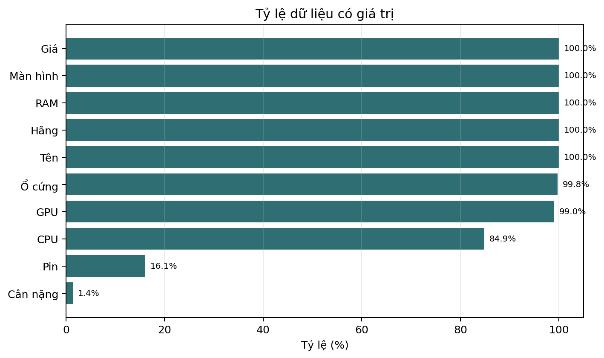

Checklist biểu đồ:

| Hình | Nội dung | Dữ liệu | Biểu đồ |
|---|---|---|---|
| Hình 8 | Tổng quan dataset | Đã có | Đã tạo |
| Hình 9 | Phân phối giá | Đã có | Đã tạo |
| Hình 10 | Phân khúc giá | Đã có | Đã tạo |
| Hình 11 | Số SKU theo hãng | Đã có | Đã tạo |
| Hình 12 | Cấu hình phổ biến | Đã có | Đã tạo |
| Hình 13 | Giá theo RAM | Đã có | Đã tạo |
| Hình 14 | Loại GPU | Đã có | Đã tạo |
| Hình 15 | Model GPU | Đã có | Đã tạo |
| Hình 16 | Giá theo model GPU | Đã có | Đã tạo |
| Hình 17 | Màn hình và giá | Đã có | Đã tạo |
| Hình 18 | Đánh đổi theo nhóm màn hình | Đã có | Đã tạo |

Nhận xét chính:

- Dataset đã được thu gọn về FPT-only.
- Dataset không trùng URL; 417 SKU tương ứng 364 tên sản phẩm duy nhất.
- Giá bán có fill rate 100%.
- RAM có fill rate 100.0%, Storage 99.8%, Screen Size 100.0%, GPU manufacturer/model/type 99.0%, đủ tốt cho matching Top-K theo cấu hình.
- Hãng CPU đạt 84.9%; phần thiếu chủ yếu rơi vào các SKU có tên CPU chưa thể map chắc chắn.
- Weight chỉ đạt 1.4% và Battery đạt 16.1%; các scoring portability/battery vẫn chủ yếu dùng fallback trung lập.

## 3.2 Phân tích đơn biến

### 3.2.1 Phân phối giá và phân khúc ngân sách

**Hình 9:** Phân phối giá laptop.  
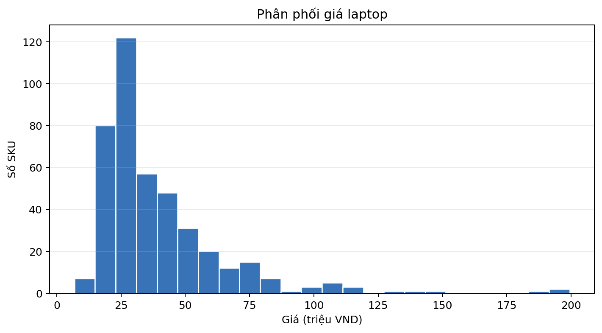

Thống kê giá hiện tại:

| Chỉ số | Giá trị |
|---|---:|
| Thấp nhất | 6,890,000 VND |
| Trung vị | 30,690,000 VND |
| Cao nhất | 199,490,000 VND |

Phân khúc sử dụng trong EDA:

| Phân khúc | Khoảng giá |
|---|---|
| Giá rẻ | `< 15M` |
| Tầm trung | `15M đến < 25M` |
| Cận cao cấp | `25M đến < 40M` |
| Cao cấp | `>= 40M` |

**Hình 10:** Số SKU theo phân khúc giá.
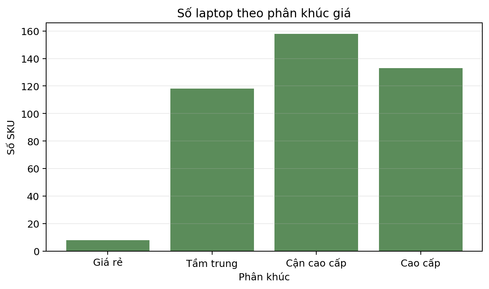

| Phân khúc | Số SKU | Tỷ lệ |
|---|---:|---:|
| Giá rẻ | 8 | 1.9% |
| Tầm trung | 118 | 28.3% |
| Cận cao cấp | 158 | 37.9% |
| Cao cấp | 133 | 31.9% |

Phần lớn danh mục tập trung từ 25 triệu đồng trở lên: hai nhóm cận cao cấp và cao cấp chiếm 69.8% tổng số SKU.

### 3.2.2 Thị phần nhà sản xuất

Phân bố hãng hiện tại:

| Hãng | Số SKU |
|---|---:|
| Apple | 105 |
| Asus | 84 |
| Acer | 52 |
| HP | 50 |
| Lenovo | 38 |
| Dell | 35 |
| MSI | 33 |
| Gigabyte | 11 |
| Colorful | 7 |
| LG | 1 |
| Masstel | 1 |

**Hình 11:** Số SKU theo hãng.
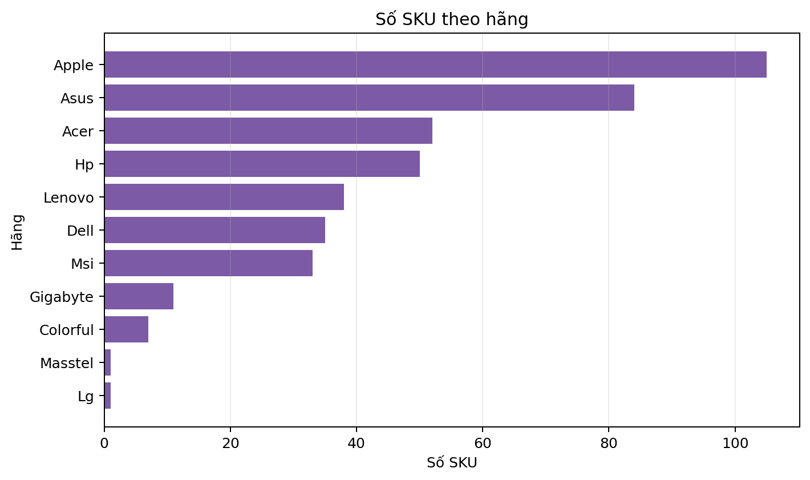

Apple và Asus là hai hãng có số SKU lớn nhất, lần lượt chiếm 25.2% và 20.1% dataset.

## 3.3 Xu hướng phần cứng

### 3.3.1 Cấu hình RAM sau chuẩn hóa

Phân bố RAM hiện tại:

| RAM | Số SKU |
|---:|---:|
| 4GB | 1 |
| 8GB | 20 |
| 12GB | 1 |
| 16GB | 259 |
| 24GB | 47 |
| 32GB | 69 |
| 36GB | 5 |
| 48GB | 8 |
| 64GB | 6 |
| 128GB | 1 |

Phân bố ổ cứng hiện tại:

| Storage | Số SKU |
|---:|---:|
| 128GB | 1 |
| 256GB | 6 |
| 512GB | 279 |
| 1TB | 91 |
| 2TB | 27 |
| 3TB | 1 |
| 4TB | 9 |
| 6TB | 1 |
| 8TB | 1 |
| Thiếu | 1 |

**Hình 12:** Top cấu hình RAM, ổ cứng và hãng GPU.
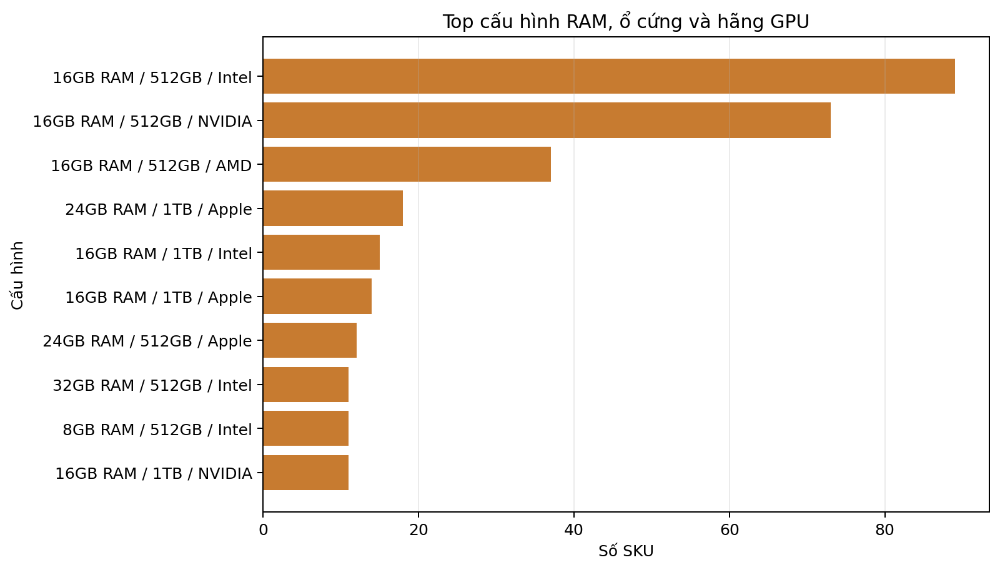

Cấu hình phổ biến nhất là 16GB RAM, 512GB và GPU Intel với 87 SKU; tiếp theo là 16GB RAM, 512GB và GPU NVIDIA với 73 SKU.

**Hình 13:** Giá theo dung lượng RAM.  
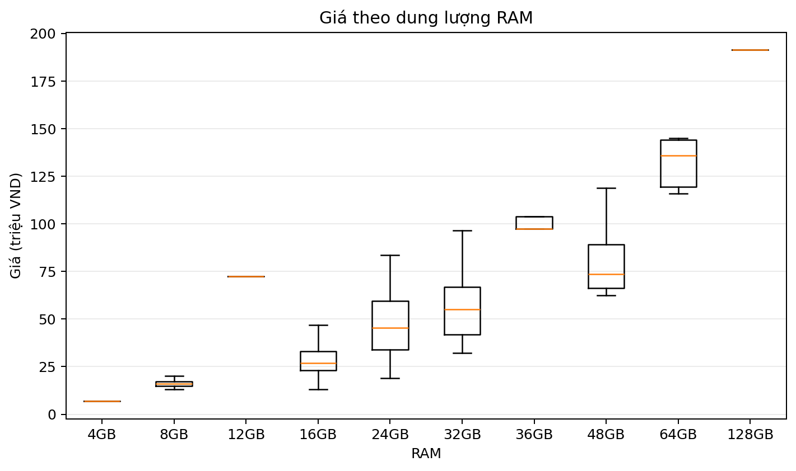

Giá có xu hướng tăng theo dung lượng RAM. Các nhóm 4GB, 12GB và 128GB chỉ có một SKU nên đường biểu diễn của các nhóm này không đại diện cho một phân phối hoàn chỉnh.

### 3.3.2 Bức tranh GPU

Dataset chuẩn hóa GPU ở ba mức: hãng GPU, model GPU và loại GPU. Nguồn trích xuất gồm trường `Card đồ hoạ` trong raw specs, tên SKU và thông tin CPU/SoC. Cả ba trường đạt fill rate 99.0%, tương ứng 413/417 SKU.

| Hãng GPU | Số SKU |
|---|---:|
| Intel | 141 |
| NVIDIA | 112 |
| Apple | 105 |
| AMD | 50 |
| Qualcomm | 5 |
| Thiếu | 4 |

Phân loại GPU:

| Loại GPU | Số SKU | Tỷ lệ |
|---|---:|---:|
| GPU tích hợp | 301 | 72.2% |
| GPU rời | 112 | 26.9% |
| Chưa xác định | 4 | 1.0% |

Toàn bộ SKU NVIDIA hiện tại dùng RTX hoặc MX570A và được xếp vào GPU rời. GPU Intel, AMD Radeon tích hợp, Apple và Qualcomm được xếp vào GPU tích hợp.

**Hình 14:** Số SKU theo loại GPU.
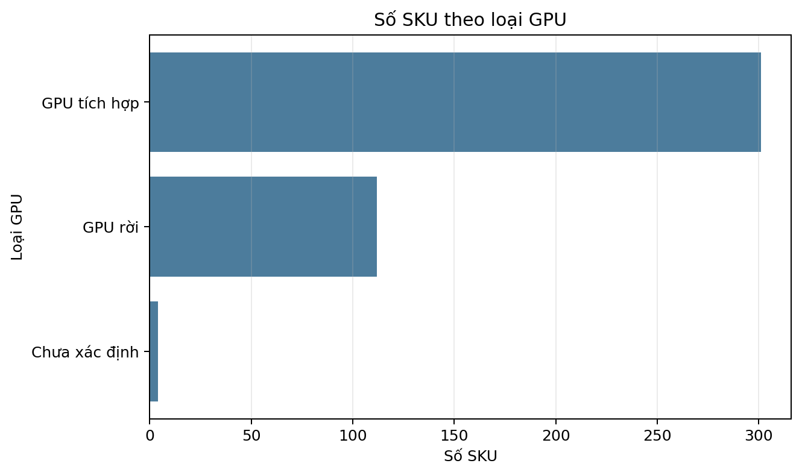

**Hình 15:** Top 10 model GPU.  
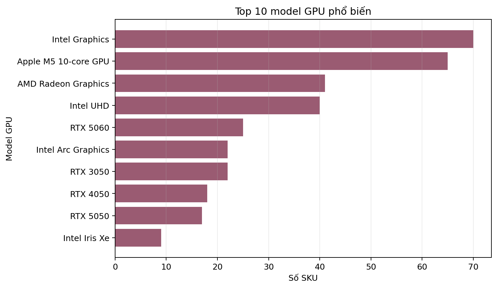

| Model GPU | Số SKU |
|---|---:|
| Intel Graphics | 70 |
| Apple M5 10-core GPU | 65 |
| AMD Radeon Graphics | 41 |
| Intel UHD | 40 |
| RTX 5060 | 25 |
| RTX 3050 | 22 |
| Intel Arc Graphics | 22 |
| RTX 5050 | 20 |
| RTX 4050 | 17 |
| Intel Iris Xe | 9 |

**Hình 16:** Giá theo Top 10 model GPU.
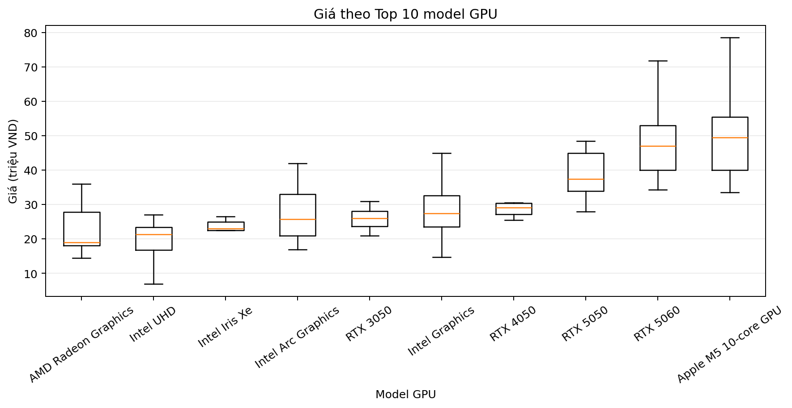

| Model GPU | Giá trung vị |
|---|---:|
| AMD Radeon Graphics | 18.99M |
| Intel UHD | 21.29M |
| Intel Iris Xe | 22.99M |
| Intel Arc Graphics | 25.79M |
| RTX 3050 | 26.04M |
| Intel Graphics | 27.49M |
| RTX 4050 | 28.99M |
| RTX 5050 | 37.69M |
| RTX 5060 | 46.99M |
| Apple M5 10-core GPU | 49.49M |

Nhìn chung, giá trung vị tăng theo phân khúc GPU. Tuy nhiên, GPU không phải yếu tố duy nhất quyết định giá; thương hiệu, CPU, RAM, màn hình và thiết kế cũng tạo ra độ phân tán lớn trong từng nhóm.

## 3.4 Phân tích tính di động và đặc điểm vật lý

Ba tín hiệu chính phục vụ phân tích tính di động là kích thước màn hình, cân nặng và pin. Mức độ đầy đủ hiện tại:

| Thuộc tính | Số SKU có dữ liệu | Fill rate |
|---|---:|---:|
| Kích thước màn hình | 417 | 100.0% |
| Cân nặng | 6 | 1.4% |
| Thông tin pin tổng quát | 67 | 16.1% |
| Thời lượng pin theo giờ | 63 | 15.1% |
| Dung lượng pin Wh | 4 | 1.0% |

Dữ liệu cân nặng quá thưa để suy rộng cho toàn bộ danh mục. Sáu SKU có cân nặng nằm trong khoảng 1.2–1.4kg và chủ yếu là laptop 14 inch, nhưng đây không phải mẫu đại diện cho 417 SKU.

Phân bố theo nhóm màn hình:

| Nhóm màn hình | Số SKU | Tỷ lệ |
|---|---:|---:|
| Tối đa 14 inch | 169 | 40.5% |
| Trên 14 đến 15.6 inch | 142 | 34.1% |
| Trên 15.6 inch | 106 | 25.4% |

Trong 63 SKU có thời lượng pin theo giờ, mức phổ biến nhất là 24 giờ với 24 SKU và 18 giờ với 23 SKU. Phần lớn các giá trị này thuộc dòng MacBook, vì vậy không nên xem đây là phân phối pin đại diện cho toàn bộ FPT Shop.

## 3.5 Phân tích đánh đổi tính di động

Do dữ liệu cân nặng chỉ đạt 1.4%, phân tích đánh đổi được thực hiện bằng kích thước màn hình, giá và loại GPU. Màn hình nhỏ được dùng như một proxy thận trọng cho tính gọn nhẹ, nhưng không thay thế hoàn toàn cân nặng thực tế.

**Hình 17:** Kích thước màn hình và giá theo loại GPU.
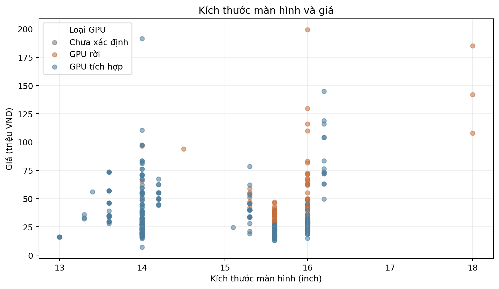

Biểu đồ cho thấy GPU rời xuất hiện chủ yếu ở nhóm màn hình từ 15.6 inch trở lên. Nhóm 13–14 inch phần lớn sử dụng GPU tích hợp, nhưng giá vẫn có thể cao do thương hiệu, CPU, chất lượng màn hình và thiết kế.

### 3.5.1 Đánh đổi giữa màn hình, giá và GPU

**Hình 18:** Giá và tỷ lệ GPU rời theo nhóm màn hình.
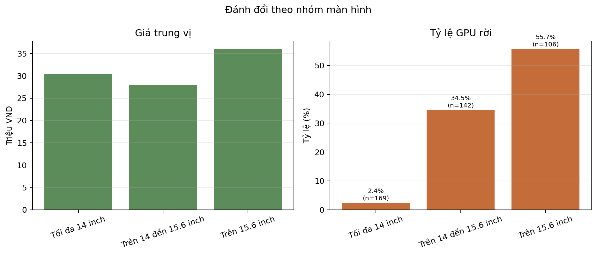

| Nhóm màn hình | Số SKU | Giá trung vị | Tỷ lệ GPU rời |
|---|---:|---:|---:|
| Tối đa 14 inch | 169 | 30.49M | 2.4% |
| Trên 14 đến 15.6 inch | 142 | 27.99M | 34.5% |
| Trên 15.6 inch | 106 | 35.99M | 55.7% |

Nhóm trên 15.6 inch có giá trung vị cao nhất và hơn một nửa số SKU dùng GPU rời, phản ánh xu hướng tập trung laptop gaming/hiệu năng cao ở màn hình lớn. Nhóm tối đa 14 inch gần như không có GPU rời nhưng giá trung vị vẫn cao hơn nhóm trung gian, chủ yếu do sự hiện diện của ultrabook và MacBook cao cấp. Đây là đánh đổi giữa không gian hiển thị, hiệu năng đồ họa và tính gọn nhẹ; kết luận về cân nặng cần được kiểm chứng lại khi coverage Weight đủ lớn.

---

# 4. Tiền xử lý dữ liệu

Tiền xử lý chuyển dữ liệu đã trích xuất thành tập đặc trưng ổn định cho hệ thống gợi ý. Trước khi chọn phương pháp xử lý, hệ thống thực hiện kiểm tra để đo giá trị thiếu, dữ liệu trùng lặp, giá trị ngoài miền và mức sẵn sàng của dữ liệu bán lẻ.

Trong audit, “trước xử lý” là bảng feature cơ sở được parse lại từ raw JSON bằng `extract_features()`, trước khi thêm default retail, ép kiểu toàn bộ DataFrame, chuẩn hóa và tạo scoring features. “Sau xử lý” là `data/fpt_laptops_features.csv`.

Quá trình kiểm tra chất lượng dữ liệu được triển khai trong `src/preprocessing/audit_data_quality.py`.

Các artifact được tạo:

- `reports/preprocessing/summary.json`
- `reports/preprocessing/missing_values.csv`
- `reports/preprocessing/quality_issues.csv`
- `reports/preprocessing/retail_availability.csv`

## 4.1 Chẩn đoán chất lượng dữ liệu

### 4.1.1 Quy mô và trùng lặp

| Chỉ số | Kết quả |
|---|---:|
| Số dòng raw | 417 |
| Số dòng feature CSV | 417 |
| Số URL duy nhất | 417 |
| Dòng trùng URL | 0 |
| Dòng trùng hoàn toàn | 0 |
| Tên sản phẩm duy nhất | 364 |
| Dòng có tên sản phẩm lặp | 53 |
| Dòng thiếu tên, URL hoặc giá | 0 |

Không có trùng lặp theo URL hoặc trùng lặp toàn bộ dòng. Có 53 dòng lặp tên sản phẩm, nhưng các dòng này có URL/SKU riêng và thường đại diện cho màu sắc hoặc cấu hình bán hàng khác nhau. Vì vậy, khóa khử trùng lặp được chọn là URL thay vì `Product Name`; xóa theo tên sẽ làm mất biến thể SKU hợp lệ.

### 4.1.2 Giá trị thiếu

Các cột ảnh hưởng trực tiếp đến recommendation:

| Thuộc tính | Thiếu | Tỷ lệ thiếu | Cách xử lý |
|---|---:|---:|---|
| Hãng CPU | 63 | 15.1% | Suy luận từ CPU spec/tên SKU; giữ thiếu nếu không chắc chắn |
| Thế hệ CPU | 226 | 54.2% | Không điền theo trung vị; scoring dùng tín hiệu dòng CPU |
| Xung CPU | 417 | 100.0% | Không dùng làm hard filter |
| Loại RAM | 417 | 100.0% | Giữ cột cho lần crawl sau, chưa dùng để lọc |
| Bus RAM | 417 | 100.0% | Giữ thiếu, không suy đoán từ dung lượng RAM |
| Storage | 1 | 0.2% | Suy luận từ tên SKU và chuẩn hóa GB/TB |
| Độ phân giải | 417 | 100.0% | Chưa dùng làm ràng buộc bắt buộc |
| Tần số quét | 417 | 100.0% | Gaming ranking dựa thêm vào GPU và tên dòng máy |
| Model GPU | 4 | 1.0% | Kết hợp raw specs, tên SKU và CPU/SoC |
| Cân nặng | 411 | 98.6% | Giữ thiếu; dùng fallback trung lập khi scoring |
| Thông tin pin | 350 | 83.9% | Tách riêng Wh và thời lượng giờ, không quy đổi chéo |

**Hình 19:** Tỷ lệ thiếu trước và sau tiền xử lý.
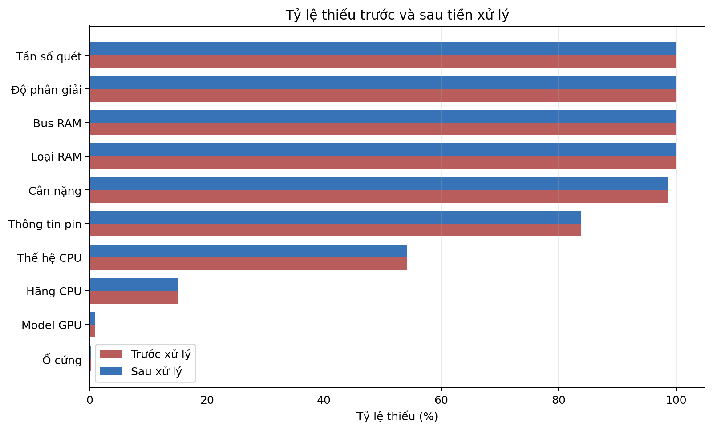

Nhiều cột có tỷ lệ thiếu sau tiền xử lý không giảm. Đây là chủ đích: pipeline chỉ điền khi có tín hiệu đáng tin cậy từ specs hoặc tên SKU, không dùng mean/median/mode để tạo thông số kỹ thuật không có thật. Missing được giữ ở lớp dữ liệu; fallback `0.5` chỉ được dùng ở lớp scoring để tránh lỗi tính toán.

### 4.1.3 Giá trị ngoài miền và trường bắt buộc

Các miền kiểm tra được chọn theo phạm vi laptop hợp lý:

| Kiểm tra | Miền hợp lệ | Số vi phạm |
|---|---|---:|
| Giá bán | 3–300 triệu VND | 0 |
| RAM | 4–128GB | 0 |
| Storage | 128–8192GB | 0 |
| Màn hình | 10–20 inch | 0 |
| Cân nặng | 0.5–6kg | 0 |
| Pin | 20–150Wh | 0 |

Không có dòng nào thiếu bất kỳ trường bắt buộc nào trong ba trường tên, URL và giá. Vì vậy, lần build hiện tại giữ đủ 417 SKU sau validation.

**Hình 20:** Các vấn đề chất lượng dữ liệu.
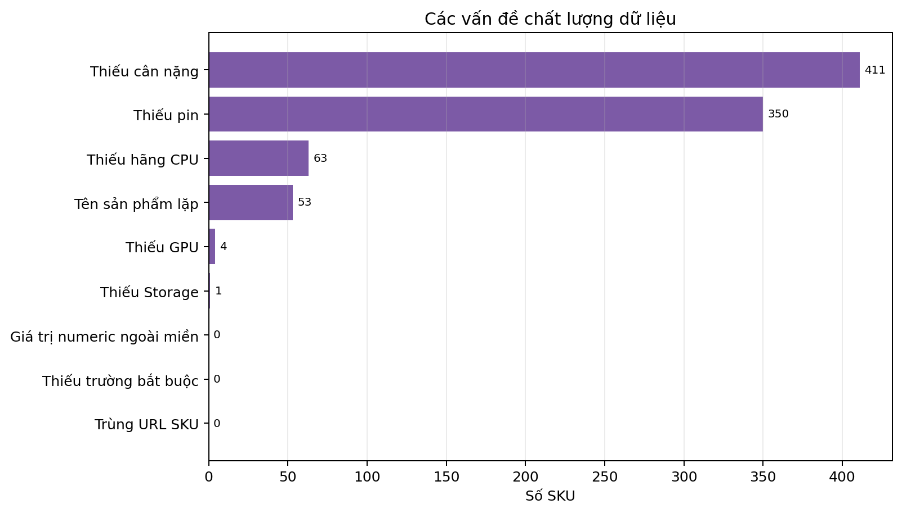

### 4.1.4 Dữ liệu retail và thiếu ngữ nghĩa

Một giá trị không rỗng chưa chắc là dữ liệu quan sát được. Ba cột retail được điền default để giữ schema nhưng nguồn crawl không cung cấp bằng chứng thực tế:

| Trường | Có dữ liệu nguồn | Giá trị lưu trong CSV | Cách sử dụng |
|---|---:|---|---|
| Giá gốc | 0/417 | Missing | Không tính mức giảm |
| Trả góp 0% | 0/417 | `False` mặc định | Không khẳng định không hỗ trợ trả góp |
| Ưu đãi HSSV | 0/417 | `0` mặc định | Không dùng làm bonus thực tế |
| Quà tặng | 0/417 | Missing | Không hiển thị ưu đãi |
| Tồn kho | 0/417 | `In Stock` fallback | Không xem là tồn kho thời gian thực |

Do đó, audit phân biệt **thiếu vật lý** và **thiếu ngữ nghĩa**. Giá trị mặc định chỉ phục vụ khả năng tương thích API, không được dùng làm bằng chứng kinh doanh.

### 4.1.5 Ánh xạ vấn đề sang phương pháp

| Điểm yếu quan sát được | Phương pháp triển khai | Lý do lựa chọn |
|---|---|---|
| Có tên lặp nhưng URL khác nhau | Loại trùng theo URL | Bảo toàn các biến thể SKU |
| Thiếu trường bắt buộc | Loại dòng thiếu tên/URL/giá | Recommendation cần định danh và giá hợp lệ |
| Thiếu CPU/GPU một phần | Rule-based inference từ specs và tên SKU | Dữ liệu kỹ thuật có pattern rõ, dễ kiểm chứng |
| Thiếu Weight/Battery lớn | Giữ missing, fallback trung lập khi scoring | Tránh bịa thông số và bias về một nhóm sản phẩm |
| Đơn vị GB/TB, VND, inch không đồng nhất | Phân tích và chuyển về dữ liệu số theo một đơn vị chuẩn | Cho phép lọc, so sánh và chuẩn hóa |
| Numeric có nguy cơ sai miền | Range validation | Bắt lỗi regex như nhầm mã GPU thành dung lượng |
| Retail default nhưng không có nguồn thật | Tách source availability khỏi fill rate | Tránh báo cáo sai về ưu đãi/tồn kho |

## 4.2 Làm sạch và xử lý thiếu

Các bước triển khai trong `src/build_dataset.py` và `src/advisor/features.py`:

1. Loại trùng theo URL trước khi tạo các dòng đặc trưng.
2. Loại dòng không có tên hoặc giá và yêu cầu tối thiểu hai feature có ý nghĩa.
3. Chạy lại `extract_features()` để mọi lần build dùng logic parser mới nhất.
4. Chuẩn hóa giá, RAM, dung lượng lưu trữ, màn hình, cân nặng và pin về dữ liệu số.
5. Suy luận Manufacturer, RAM và Storage từ tên SKU khi raw specs thiếu.
6. Giữ `NaN` cho thông số không đủ bằng chứng.
7. Dùng fallback trung lập `0.5` ở feature chuẩn hóa khi scoring cần giá trị số.
8. Điền default retail để giữ schema, đồng thời ghi rõ đây không phải dữ liệu quan sát.

Việc không dùng mean/median imputation cho thông số kỹ thuật là lựa chọn có chủ đích. Ví dụ, điền Weight trung vị cho 411 SKU thiếu sẽ làm sai ranking portability; điền tần số quét trung vị có thể khiến laptop văn phòng bị hiểu nhầm là phù hợp gaming.

## 4.3 Chuẩn hóa GPU

GPU được chuẩn hóa ở ba mức:

- `GPU manufacturer`: Intel, NVIDIA, Apple, AMD hoặc Qualcomm.
- `GPU model`: ví dụ RTX 5060, Intel Arc Graphics, AMD Radeon Graphics hoặc Apple M5 10-core GPU.
- `GPU type`: `Integrated` hoặc `Dedicated`.

Nguồn tín hiệu theo thứ tự:

1. Trường `Card đồ hoạ` trong raw specs.
2. Tên SKU.
3. CPU/SoC để suy luận GPU tích hợp.
4. Tên dòng gaming làm fallback cho scoring.

Kết quả là 413/417 SKU có đủ hãng, model và loại GPU; bốn SKU còn lại được giữ `NaN` thay vì gán một GPU mặc định.

## 4.4 Chuẩn hóa dữ liệu số

Các đặc trưng số được chuẩn hóa bằng phương pháp phân vị bền vững:

```text
norm_x = clip((x - q05) / (q95 - q05), 0, 1)
```

Các cột normalize chính:

- `norm_ram`
- `norm_storage`
- `norm_price`
- `norm_weight`
- `norm_screen`
- `norm_battery`
- `norm_cpu`

Quantile 5% và 95% giảm ảnh hưởng của các SKU cực trị tốt hơn min-max scaling trực tiếp. Giá trị sau chuẩn hóa được clip về `[0, 1]`; riêng Weight dùng chiều nghịch đảo vì cân nặng thấp phù hợp hơn với portability. Khi toàn bộ cột hoặc một ô bị thiếu, scoring dùng fallback trung lập `0.5`, nhưng dữ liệu gốc vẫn giữ missing.

---

# 5. Xây dựng đặc trưng

## 5.1 Tổng quan

Feature engineering biến thông số kỹ thuật thành các tín hiệu phục vụ recommendation. Mục tiêu không phải huấn luyện model, mà tạo ra các score dễ giải thích cho từng nhu cầu.

Các nhóm feature chính:

- Base performance score
- GPU score
- Task-oriented scores
- Binary tags for explainability

Các đặc trưng được xây dựng bằng luật và trọng số cố định vì dataset hiện chưa có nhãn mức độ phù hợp do người dùng đánh giá. Cách tiếp cận này được lựa chọn dựa trên:

- Vai trò chức năng của CPU, GPU, RAM, dung lượng lưu trữ, cân nặng, pin và màn hình.
- Kỳ vọng phổ biến của người dùng đối với gaming, AI/đồ họa, văn phòng và tính di động.
- Các điểm nghẽn kỹ thuật đặc trưng của từng tác vụ, chẳng hạn gaming và AI phụ thuộc nhiều vào GPU.
- Yêu cầu giải thích được lý do một sản phẩm được xếp hạng cao.

Các trọng số có tổng bằng 1, được công khai trong công thức và có thể hiệu chỉnh sau khi thu thập được dữ liệu đánh giá hoặc phản hồi người dùng. Nhóm ưu đãi bán lẻ không được tạo ở bước này; chúng chỉ được xét ở recommendation engine khi có yêu cầu cụ thể và có dữ liệu nguồn đáng tin cậy.

## 5.2 Điểm cơ sở

Base performance score tổng hợp CPU, GPU, RAM và Storage:

```text
base_performance_score =
    norm_cpu * 0.45
  + gpu_score * 0.30
  + norm_ram * 0.15
  + norm_storage * 0.10
```

Score này đóng vai trò nền cho gaming, AI/graphics và general-purpose ranking.

`gpu_score` được đưa vào điểm hiệu năng cơ sở vì danh mục FPT Shop gồm laptop văn phòng, MacBook và laptop gaming với năng lực đồ họa khác biệt rõ rệt. Thành phần này giúp hệ thống phân biệt tốt hơn giữa các nhóm sản phẩm ngay từ lớp biểu diễn hiệu năng nền. CPU vẫn nhận trọng số cao nhất vì ảnh hưởng rộng đến phần lớn tác vụ.

## 5.3 Điểm hiệu năng GPU

GPU score được xác định bằng luật dựa trên model GPU, loại GPU, hãng GPU và tên sản phẩm. Dataset hiện nhận diện được GPU cho 99.0% SKU. Mỗi tín hiệu chỉ có thể nâng điểm lên mức tương ứng; luật tổng quát như `NVIDIA` hoặc tên dòng gaming không thể ghi đè và làm giảm điểm đã nhận diện từ model GPU cụ thể.

| Nhóm tín hiệu | Điểm |
|---|---:|
| RTX 50 series | 1.00 |
| RTX 40 series | 0.95 |
| RTX 30 series | 0.86 |
| RTX 20 series | 0.74 |
| Radeon RX | 0.72 |
| GTX | 0.68 |
| Dòng gaming khi thiếu model rõ ràng | 0.64 |
| GPU rời/NVIDIA chung | 0.62 |
| Intel Arc | 0.60 |
| Apple Silicon GPU | 0.58 |
| Intel Iris | 0.54 |
| GPU tích hợp phổ thông | 0.48 |
| Không nhận diện được | 0.45 |

Các tên dòng như Asus TUF/ROG, Acer Nitro/Predator, Lenovo LOQ/Legion và HP Victus chỉ đóng vai trò fallback. Cách triển khai này ưu tiên bằng chứng cụ thể từ `GPU model` trước tín hiệu marketing trong tên SKU.

## 5.4 Điểm tổng hợp theo tác vụ

Các score theo mục đích sử dụng được xây dựng để mapping từ nhu cầu tự nhiên sang ranking kỹ thuật.

### 5.4.1 Điểm gaming

```text
gaming_score =
    gpu_score * 0.60
  + base_performance_score * 0.25
  + norm_ram * 0.15
```

Gaming ưu tiên GPU và hiệu năng tổng thể.

GPU chiếm 60% vì đây thường là điểm nghẽn chính của hiệu năng game. Điểm hiệu năng cơ sở chiếm 25% để phản ánh CPU và dung lượng lưu trữ, còn RAM chiếm 15% để phân biệt các cấu hình có khả năng chạy game và đa nhiệm tốt hơn.

### 5.4.2 Điểm AI và đồ họa

```text
ai_graphics_score =
    gpu_score * 0.55
  + base_performance_score * 0.30
  + norm_ram * 0.15
```

Score này dùng cho query liên quan AI, graphics, rendering hoặc lập trình cần cấu hình mạnh.

GPU vẫn là thành phần chính nhưng có trọng số thấp hơn gaming một chút, do các tác vụ AI và dựng hình còn phụ thuộc đáng kể vào CPU và RAM.

### 5.4.3 Điểm văn phòng và doanh nghiệp

```text
office_score =
    base_performance_score * 0.45
  + norm_weight * 0.35
  + battery_score * 0.20
```

Vì Weight chỉ đạt 1.4% và Battery đạt 16.1%, các giá trị thiếu dùng mức trung lập `0.5` khi tính score. `battery_score` ưu tiên dung lượng Wh nếu có; nếu Wh thiếu nhưng nguồn cung cấp thời lượng theo giờ, score được chuẩn hóa trực tiếp trong nhóm thời lượng đó. Hệ thống không quy đổi giờ sang Wh. Khi coverage hai trường tăng, score sẽ phản ánh tốt hơn nhu cầu văn phòng/di chuyển.

### 5.4.4 Điểm tính di động

```text
portability_score =
    norm_weight * 0.45
  + battery_score * 0.35
  + (1 - norm_screen) * 0.20
```

Màn hình nhỏ đóng góp tích cực cho tính di động. Tuy nhiên, portability score hiện vẫn mang tính hỗ trợ vì dữ liệu cân nặng và pin chưa phủ đủ danh mục.

### 5.4.5 Điểm sử dụng tổng quát

```text
general_score =
    office_score * 0.45
  + base_performance_score * 0.35
  + portability_score * 0.20
```

Score này dùng cho query không có nhu cầu rõ ràng hoặc nhu cầu phổ thông.

## 5.5 Nhãn nhị phân phục vụ giải thích

Các binary tags phục vụ giải thích và UI. Khác với score liên tục, tag phụ thuộc cân nặng hoặc pin chỉ được gắn khi trường tương ứng có dữ liệu quan sát thực tế; giá trị fallback không được xem là bằng chứng.

| Tag | Điều kiện |
|---|---|
| `is_gaming_ready` | `gaming_score >= 0.60` |
| `is_ai_ready` | `ai_graphics_score >= 0.60` |
| `is_business_ready` | `office_score >= 0.55` |
| `is_ultrabook` | Có dữ liệu cân nặng và pin, đồng thời `norm_weight >= 0.70` và `battery_score >= 0.55` |
| `is_light` | Có dữ liệu cân nặng và trọng lượng không quá 1.7kg |
| `is_small_screen` | Kích thước màn hình không quá 14.1 inch |
| `is_large_screen` | Kích thước màn hình từ 15.6 inch |

Ngưỡng `is_business_ready` được đặt thấp hơn gaming và AI vì score văn phòng còn chịu ảnh hưởng lớn của fallback trung lập ở Weight/Battery. Đây là nhãn hỗ trợ giải thích, không phải hard filter. `is_ultrabook` có thể rất ít hoặc bằng 0 trên dataset hiện tại; điều này phản ánh thiếu dữ liệu quan sát thay vì tự động suy đoán từ tên dòng máy.

## 5.6 Bộ dữ liệu đặc trưng đầu ra

Output feature dataset hiện tại:

```text
data/fpt_laptops_features.csv
```

Thông tin hiện tại:

| Chỉ số | Giá trị |
|---|---:|
| Rows | 417 |
| Columns | 53 |
| Main source | FPT Shop |
| Recommendation input | Có |
| Benchmark input | Có |

Kết quả sau khi xây dựng đặc trưng:

| Chỉ số | Số SKU | Tỷ lệ |
|---|---:|---:|
| Gaming-ready | 155 | 37.2% |
| AI-ready | 156 | 37.4% |
| Business-ready | 99 | 23.7% |
| Ultrabook có đủ bằng chứng | 0 | 0.0% |
| Nhẹ không quá 1.7kg | 6 | 1.4% |
| Màn hình không quá 14.1 inch | 169 | 40.5% |
| Màn hình từ 15.6 inch | 202 | 48.4% |

Không có SKU nào được gắn nhãn ultrabook vì chưa có sản phẩm đồng thời thỏa điều kiện về dữ liệu cân nặng và pin. Kết quả này được giữ nguyên thay vì suy đoán từ tên sản phẩm.

Các cột đầu ra của bước feature engineering gồm:

- Đặc trưng chuẩn hóa: `norm_ram`, `norm_storage`, `norm_price`, `norm_weight`, `norm_screen`, `norm_battery`, `norm_cpu`.
- Điểm trung gian: `gpu_score`, `battery_score`, `base_performance_score`.
- Điểm theo tác vụ: `gaming_score`, `ai_graphics_score`, `office_score`, `portability_score`, `general_score`.
- Nhãn giải thích: `is_gaming_ready`, `is_ai_ready`, `is_business_ready`, `is_ultrabook`, `is_light`, `is_small_screen`, `is_large_screen`.

Việc tách feature engineering khỏi crawler và recommendation engine giúp các luật chấm điểm có thể được kiểm thử, hiệu chỉnh và tái sử dụng mà không cần thu thập lại dữ liệu thô.

---

# 6. Chatbot tư vấn laptop dựa trên AI

## 6.1 Mục tiêu của tính năng

Mục tiêu của chatbot là cho phép người dùng nhập nhu cầu bằng ngôn ngữ tự nhiên và nhận lại danh sách Top-K laptop FPT phù hợp, kèm giải thích dễ hiểu và link mua hàng.

Ví dụ nhu cầu:

```text
"Mình là sinh viên cần laptop văn phòng nhẹ dưới 20 triệu, trả góp 0% càng tốt"
```

Hệ thống cần trả về:

- Top-K laptop phù hợp.
- Câu trả lời tư vấn tự nhiên.
- Product cards trên frontend.

Intent và query có cấu trúc vẫn được API trả về để phục vụ kiểm thử và đánh giá, nhưng không hiển thị trực tiếp trên giao diện người dùng.

## 6.2 Tổng quan tính năng

Luồng chatbot:

1. User nhập message.
2. API trích xuất intent bằng Gemini nếu có API key, fallback rule-based nếu không.
3. Intent được bổ sung bằng luật để bắt ngân sách, RAM, SSD, hãng ưu tiên/loại trừ, mục đích sử dụng và nhu cầu bán lẻ.
   Các luật bổ sung hiện cũng nhận diện kích thước màn hình theo inch, cân nặng tối đa theo kg và dung lượng pin tối thiểu theo Wh.
4. Recommendation engine lọc và chấm điểm.
5. API trả metadata sản phẩm trước, sau đó stream câu trả lời.
6. Frontend render product cards và text streaming.

## 6.3 Kiến trúc hệ thống và công nghệ

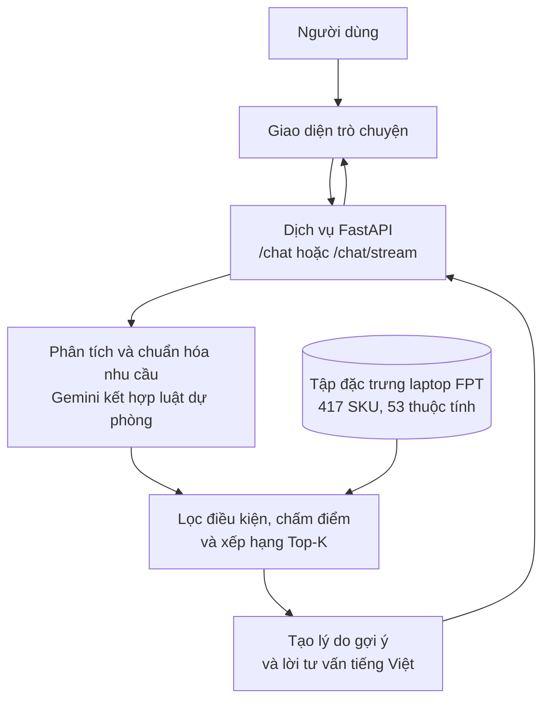

**Hình 21:** Kiến trúc chatbot tư vấn laptop FPT.

### 6.3.1 Giao diện người dùng (Frontend)

Frontend nằm trong:

```text
frontend/index.html
```

Chức năng chính:

- Chat input.
- Gọi `/chat/stream`.
- Đọc streaming JSON-lines.
- Render bot answer theo từng chunk.
- Render product cards.
- Hiển thị GPU và lý do phù hợp trên card/modal.
- Modal xem thông số và link mua FPT.
- Không hiển thị raw score, intent hoặc query nội bộ.

### 6.3.2 Dịch vụ backend

Backend nằm trong:

```text
src/api/main.py
```

Endpoints:

| Endpoint | Vai trò |
|---|---|
| `GET /health` | Kiểm tra trạng thái API và dataset |
| `POST /chat` | Trả full JSON response |
| `POST /chat/stream` | Trả metadata + text streaming |

Dataset mặc định:

```text
data/fpt_laptops_features.csv
```

### 6.3.3 Thành phần trí tuệ nhân tạo

LLM được dùng cho:

- Trích xuất ý định có cấu trúc.
- Sinh câu trả lời tư vấn tự nhiên.

LLM không quyết định sản phẩm nào được gợi ý. Toàn bộ lọc, chấm điểm và Top-K được tính bằng luật xác định trên dataset. LLM chỉ đóng vai trò diễn giải đầu vào và trình bày kết quả đã được recommendation engine lựa chọn.

Nếu không có `GEMINI_API_KEY` hoặc SDK chưa sẵn sàng, hệ thống vẫn chạy bằng fallback rule-based:

- Intent mặc định `general`, sau đó patch từ text.
- Advice fallback bằng template tiếng Việt.

Prompt sinh tư vấn chỉ cho phép đề cập ưu đãi, tồn kho, bảo hành hoặc giao hàng khi response có dữ liệu nguồn tương ứng. Các giá trị retail mặc định không được dùng để tạo khẳng định bán hàng.

## 6.4 Quy trình hoạt động của chatbot

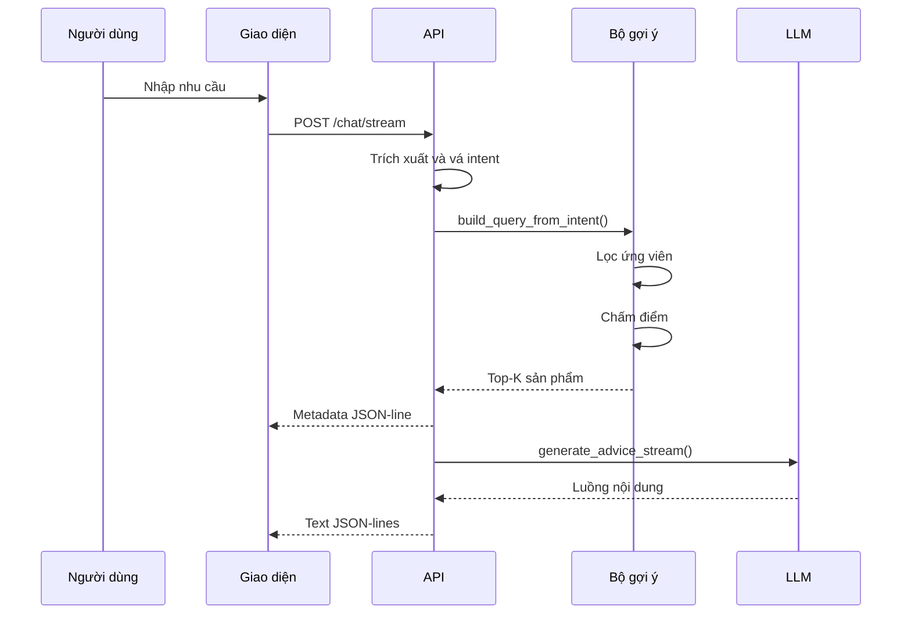

## 6.5 Thiết kế recommendation engine

### 6.5.1 Module lọc (Constraint-Based Filtering)

Filter module nằm trong:

```text
src/advisor/filters.py
```

Hard filters:

- `price_min`
- `price_max`
- `ram_exact_gb`
- `min_ram_gb`
- `min_storage_gb`
- `min_weight_kg`
- `max_weight_kg`
- Brand exclude
- CPU requirements
- Display requirements
- Battery requirements
- Stock status

Hãng ưu tiên là soft preference, trong khi hãng bị loại trừ là hard constraint. Cụm từ phủ định như “không thích Asus” được giữ thành điều kiện loại trừ thay vì bị hiểu nhầm là hãng ưu tiên.

Gaming không bị hard-filter tuyệt đối để tránh trả rỗng khi dữ liệu GPU thiếu; thay vào đó gaming được ưu tiên trong scoring. Các điều kiện Weight, Battery, Display và Stock chỉ đáng tin cậy khi trường nguồn có dữ liệu thực tế; coverage còn thấp có thể làm tập ứng viên nhỏ hoặc rỗng.

### 6.5.2 Module scoring (Multi-Criteria Ranking)

Scorer nằm trong:

```text
src/advisor/scorer.py
```

Scorer kết hợp:

- Task score theo intent.
- Affordability score.
- Weight score.
- Brand preference bonus.
- Retail bonuses:
  - `pref_installment`
  - `is_student`
  - `need_gifts`
- Battery/display/ready flag bonuses.

Final score:

```text
final_score =
    task_score * w_task
  + affordability_score * w_price
  + weight_score * w_weight
  + soft_bonuses
```

Trong đó `w_task + w_price + w_weight = 1`. Trọng số được điều chỉnh theo intent: sinh viên/học tập ưu tiên giá và tính di động hơn; gaming ưu tiên gần như toàn bộ cho task score. Khi người dùng nhấn mạnh “rẻ” hoặc “nhẹ”, trọng số tương ứng được tăng trong giới hạn định trước.

`norm_weight` đã được chuẩn hóa theo chiều điểm cao tương ứng với máy nhẹ, vì vậy `weight_score` sử dụng trực tiếp giá trị này. Sản phẩm có cân nặng thực tế cao còn nhận thêm penalty khi người dùng yêu cầu máy nhẹ.

Soft bonus chỉ tạo khác biệt khi có dữ liệu thật:

- Hãng được ưu tiên.
- Trả góp, ưu đãi HSSV và quà tặng.
- Pin, tần số quét và các nhãn phù hợp tác vụ.

Sau khi cộng bonus và áp dụng penalty, điểm được giới hạn trong `[0, 1]`, sắp xếp giảm dần, khử trùng lặp theo tên sản phẩm rồi mới lấy Top-K. Bước khử trùng lặp này giúp tránh trả nhiều SKU gần giống nhau của cùng một mẫu máy trong một phản hồi tư vấn.

### 6.5.3 Module advisor (Explainability Layer)

Advisor layer gồm:

- `src/advisor/advisor.py`: gọi filter, scorer và tạo lý do phù hợp từ các tín hiệu có cấu trúc.
- `src/advisor/recommend_service.py`: chuyển dataframe Top-K thành JSON.
- `src/llm/prompts.py`: persona tư vấn viên FPT Shop.

Output recommendation JSON gồm:

- Tên máy.
- Brand.
- Giá bán.
- Giá gốc nếu có.
- RAM/Storage/Screen/CPU/GPU/Pin.
- Retail fields: trả góp, quà tặng, ưu đãi HSSV.
- Lý do phù hợp theo intent.
- Scores và flags phục vụ đánh giá nội bộ.
- Link mua hàng.

Fallback template cũng sử dụng tên máy, giá, cấu hình nổi bật, GPU và lý do phù hợp. Vì vậy chatbot vẫn trả được nội dung có căn cứ khi không cấu hình Gemini.

Các kiểm thử cục bộ bao phủ:

- Máy nhẹ nhận điểm Weight cao hơn máy nặng.
- Intel thế hệ 14 thỏa điều kiện tối thiểu thế hệ 13.
- Hãng bị phủ định được đưa vào danh sách loại trừ.
- Màn hình, cân nặng, pin Wh và cụm "giá hợp lý" được trích xuất từ câu người dùng.
- `/chat` trả đúng Top-K, cấu hình GPU và lý do phù hợp ở chế độ fallback.
- `/chat/stream` trả metadata trước và các đoạn văn bản sau.

---

# 7. Đánh giá

## 7.1 Bộ câu hỏi đánh giá

Benchmark hiện tại dùng:

```text
data/fpt_test_queries.json
```

Số query hiện tại: 16.

Các nhóm query:

- Sinh viên/văn phòng/ngân sách.
- Gaming dưới ngân sách.
- Brand preference.
- Laptop nhẹ.
- MacBook/pin tốt/doanh nhân.
- RAM/SSD constraints.
- AI/lập trình.
- Màn hình, cân nặng, CPU generation và pin Wh.
- Retail stress test cho dữ liệu quà tặng.
- Query phổ thông.

## 7.2 Chấm điểm độ phù hợp

Evaluator nằm trong:

```text
src/evaluation/evaluator.py
```

Hai chế độ judge:

| Judge | Mục đích |
|---|---|
| `rule` | Offline benchmark, deterministic, không cần API key |
| `gemini` | LLM relevance judge nếu có Gemini key |

Rule-based judge chấm điểm:

- `2`: phù hợp đầy đủ.
- `1`: phù hợp một phần hoặc là lựa chọn thay thế hợp lý.
- `0`: không phù hợp.

## 7.3 Chỉ số đánh giá

Các metric giống cấu trúc benchmark mẫu:

### Precision@K

```text
Precision@K = số item relevant trong Top-K / K
```

Trong benchmark này, item được xem là relevant nếu relevance score là `1` hoặc `2`.

### Strict Precision@K

Strict Precision@K chỉ tính item có relevance score bằng `2`, tức là phù hợp đầy đủ với nhu cầu. Chỉ số này nghiêm hơn Precision@K và phản ánh tốt hơn mức độ khớp sâu của recommendation.

```text
Strict Precision@K = số item có relevance = 2 trong Top-K / K
```

### Normalized Relevance@K

Normalized Relevance@K dùng trực tiếp thang relevance `0-2` và chuẩn hóa về `[0, 1]`. Chỉ số này không chỉ phân biệt đúng/sai mà còn phản ánh mức độ phù hợp trung bình của toàn bộ Top-K.

```text
Normalized Relevance@K = tổng relevance trong Top-K / (2 * K)
```

### Full-Match Query Rate

Full-Match Query Rate đo tỷ lệ query có toàn bộ Top-K vừa đạt relevance `2` vừa thỏa tất cả hard constraints. Đây là chỉ số nghiêm nhất trong benchmark hiện tại.

```text
Full-Match Query Rate = số query đạt full-match / tổng số query
```

### NDCG@K

Đo chất lượng thứ tự ranking, ưu tiên item relevance cao ở vị trí đầu.

### MRR

Mean Reciprocal Rank đo vị trí của item relevant đầu tiên.

### CSR

Constraint Satisfaction Rate đo tỷ lệ recommendations thỏa tất cả hard constraints.

```text
CSR = số recommendation thỏa constraints / số recommendation
```

### Unique Name Rate

Do dataset FPT được tổ chức theo SKU, cùng một mẫu máy có thể xuất hiện ở nhiều màu hoặc cấu hình gần giống nhau. Unique Name Rate đo tỷ lệ tên sản phẩm không bị lặp trong Top-K.

```text
Unique Name Rate = số tên sản phẩm duy nhất trong Top-K / số recommendation trong Top-K
```

## 7.4 Kết quả

Kết quả benchmark offline ngày 2026-06-12 được chia thành hai nhóm: metric chính dùng để trình bày chất lượng hệ thống, và metric chẩn đoán dùng để kiểm tra các thuộc tính phụ.

Metric chính:

| Metric | Value |
|---|---:|
| Num queries | 16 |
| Top-K | 3 |
| Strict Precision@K | 0.9375 |
| Normalized Relevance@K | 0.9688 |
| Full-Match Query Rate | 0.9375 |
| CSR | 0.9375 |

Metric chẩn đoán:

| Metric | Value | Diễn giải |
|---|---:|---|
| Precision@K | 1.0000 | Không có recommendation bị chấm `0` |
| NDCG@K | 1.0000 | Các item có cùng mức relevance trong từng Top-K nên thứ tự không tạo lỗi |
| MRR | 1.0000 | Recommendation đầu tiên của mọi query đều có liên quan |
| Unique Name Rate | 1.0000 | Top-K không lặp cùng tên sản phẩm |

Kết quả này được tạo bởi mô-đun đánh giá `src/evaluation/run_evaluation.py`, theo phương pháp benchmark offline dựa trên luật trên dataset hiện tại.

Phân bố relevance trong 48 recommendation được chấm:

| Mức relevance | Ý nghĩa | Số recommendation |
|---|---|---:|
| 2 | Phù hợp đầy đủ | 45 |
| 1 | Phù hợp một phần / lựa chọn thay thế hợp lý | 3 |
| 0 | Không phù hợp | 0 |

Precision@K đạt 1.0000 vì cả relevance `1` và `2` đều được xem là recommendation có liên quan, nên chỉ số này chủ yếu chứng minh hệ thống không trả item sai rõ ràng. Khi dùng thước đo nghiêm hơn, Strict Precision@K đạt 0.9375 và Normalized Relevance@K đạt 0.9688. Ba recommendation chưa đạt full-match thuộc query yêu cầu quà tặng kèm; các máy vẫn đúng ngân sách và phù hợp học tập, nhưng chưa thỏa điều kiện quà tặng do trường `Gifts` trong dataset hiện chưa được populate đầy đủ.

Unique Name Rate đạt 100% sau khi recommendation engine khử trùng lặp theo tên sản phẩm ở bước chọn Top-K. Điều này quan trọng vì dữ liệu FPT là dữ liệu SKU; nếu không khử trùng lặp, một query có thể nhận nhiều biến thể cùng tên, làm giảm trải nghiệm tư vấn.

## 7.5 Phân tích

Kết quả hiện tại cho thấy:

- Matching Top-K hoạt động ổn trên 16 query benchmark đã định nghĩa.
- Strict Precision@K ở mức 0.9375 cho thấy phần lớn kết quả đã khớp đầy đủ với nhu cầu.
- Normalized Relevance@K đạt 0.9688, cho thấy mức phù hợp trung bình của Top-K cao nhưng vẫn còn khoảng cách ở nhóm retail.
- Full-Match Query Rate đạt 0.9375, tương ứng 15/16 query có toàn bộ Top-K đạt đầy đủ relevance và constraints.
- CSR đạt 0.9375; phần chưa đạt đến từ query có yêu cầu quà tặng kèm trong khi dữ liệu quà tặng chưa đầy đủ.
- Query gaming không bị trả rỗng nhờ chuyển gaming từ hard-filter sang scoring.
- Brand, RAM, Storage, khoảng giá, màn hình, cân nặng, pin Wh và retail intent được patch bằng rule từ text.
- Top-K không còn lặp cùng tên sản phẩm, phù hợp hơn với cách người dùng kỳ vọng nhận danh sách lựa chọn.
- Retail intent được nhận diện ở tầng hội thoại, nhưng bonus tương ứng chưa tạo khác biệt đáng kể vì dữ liệu ưu đãi hiện chưa được populate.

Một điểm cần diễn giải thận trọng là Precision@K, NDCG@K, MRR và Unique Name Rate đều đạt 1.0 trên bộ benchmark hiện tại không có nghĩa hệ thống đã đúng trong mọi tình huống. Vì vậy, các chỉ số này chỉ được xem là metric chẩn đoán. Phần đánh giá chính nên dựa vào Strict Precision@K, Normalized Relevance@K, Full-Match Query Rate và CSR vì các chỉ số này phản ánh rõ hơn các hạn chế thực tế, đặc biệt là dữ liệu retail chưa đầy đủ. Bộ query hiện gồm 16 câu đại diện cho các nhóm nhu cầu chính; ở các vòng sau nên mở rộng thêm query khó hơn, ví dụ phủ định phức tạp, yêu cầu tồn kho theo khu vực, yêu cầu khuyến mãi cụ thể, hoặc so sánh giữa nhiều tác vụ cùng lúc.

Các hạn chế cần tiếp tục cải thiện:

- Weight và Battery đã trích xuất được một phần nhưng coverage còn thấp, lần lượt 1.4% và 16.1%.
- Bốn SKU chưa xác định được GPU; logic vẫn dùng thêm tín hiệu tên dòng máy làm fallback.
- Retail fields như `Gifts`, `Original Price`, `Student Discount` cần parse tốt hơn từ trang FPT.
- `Stock Status` hiện là fallback `In Stock`, chưa phản ánh tồn kho thực tế.
- Gemini judge chưa chạy trong benchmark chính thức.

## 7.6 Thảo luận

Hướng đánh giá tiếp theo:

1. Chạy lại crawl FPT để lấy dữ liệu mới.
2. Build lại `fpt_laptops_features.csv`.
3. Kiểm tra fill rate sau crawl.
4. Chạy benchmark rule-based.
5. Nếu có Gemini key, chạy thêm Gemini relevance judge.
6. Cập nhật các bảng Section 2, 3 và 7.

Checklist cập nhật kết quả:

| Bước | Thành phần thực hiện | Kết quả cần ghi |
|---|---|---|
| Thu thập dữ liệu FPT | Mô-đun thu thập dữ liệu | Số SKU thô |
| Xây dựng bảng đặc trưng | Mô-đun xây dựng dataset | Số dòng, số cột và tỷ lệ có dữ liệu |
| Kiểm tra nhanh API | Endpoint hội thoại | Số sản phẩm gợi ý và kết quả mẫu |
| Đánh giá hệ thống | Mô-đun benchmark | Precision@K, NDCG@K, MRR, CSR |

---

# 8. Kết luận

Dự án hiện tại đã chuyển từ hướng laptop advisor tổng quát sang chatbot tư vấn laptop chuyên biệt cho FPT Shop. Pipeline chính đã được thu gọn và tập trung vào dữ liệu FPT-only, với dataset chính là `data/fpt_laptops_features.csv`.

Hệ thống hiện có đầy đủ các thành phần cốt lõi:

- FPT crawler và parser.
- Feature extraction và preprocessing.
- Rule-based scoring engine.
- FastAPI backend với streaming.
- Frontend chat UI.
- LLM intent/advice integration có fallback.
- Evaluation pipeline với các metric IR và CSR.

Điểm mạnh của hệ thống là tính minh bạch: recommendation không phụ thuộc vào model học máy khó giải thích, mà dựa trên scoring rõ ràng và có thể kiểm thử. Điều này phù hợp với bài toán tư vấn bán lẻ, nơi hệ thống cần tránh bịa thông tin và chỉ tư vấn dựa trên dữ liệu sản phẩm có thật.

Các bước tiếp theo là tiếp tục cải thiện parser cho Weight, Battery và retail fields; chạy lại benchmark trên feature CSV 53 cột; sau đó cập nhật kết quả đánh giá và thử nghiệm chatbot bằng dữ liệu mới.

---

# 9. Phân công thành viên

| Thành viên | MSSV | Phân công | Trạng thái |
|---|---|---|---|
| Cập nhật sau | Cập nhật sau | Data crawling / preprocessing | TBD |
| Cập nhật sau | Cập nhật sau | Feature engineering / scoring | TBD |
| Cập nhật sau | Cập nhật sau | Backend / LLM / streaming | TBD |
| Cập nhật sau | Cập nhật sau | Frontend / evaluation / report | TBD |

---

## Nhật ký chạy

Phần này dùng để cập nhật kết quả sau mỗi lần chạy pipeline.

| Ngày | Bước | Thành phần thực hiện | Kết quả | Ghi chú |
|---|---|---|---|---|
| 2026-06-11 | Tạo bản thảo báo cáo | Tài liệu báo cáo | Hoàn thành cấu trúc báo cáo | Chờ thực hiện pipeline chính thức |
| 2026-06-11 | Thu thập dữ liệu laptop FPT | Mô-đun thu thập dữ liệu | 417 SKU thô, 364 tên duy nhất | Không thiếu URL, tên, giá, ảnh |
| 2026-06-11 | Xây dựng bảng đặc trưng | Mô-đun xây dựng dataset | 417 dòng, 53 cột | RAM 100.0%, Storage 99.8%, GPU 99.0%, Weight 1.4%, Battery 16.1% |
